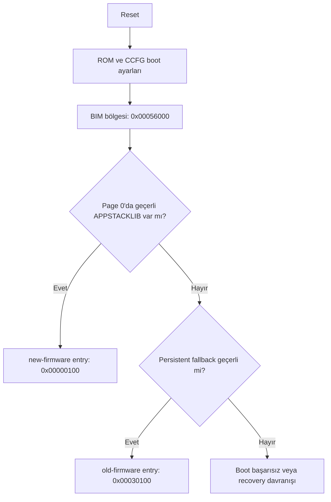
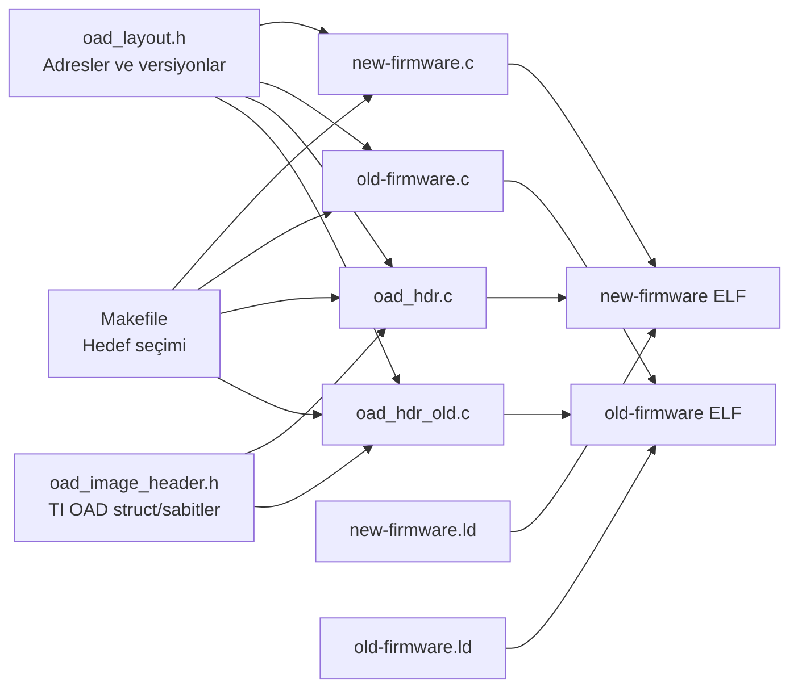
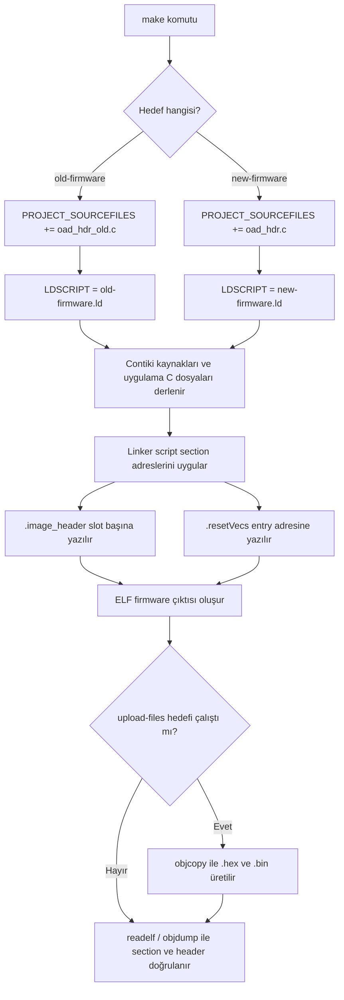

<div align="center">


<h1>BIL304 HW3 - 3. Aşama</h1>

<p>
  
  
  
  
</p>

<p>
  <b>CC1352R Gerçekleme ve Donanım Uyarlama Görevi</b>
</p>

<p>
  Mevcut BIM korunur | Old firmware fallback 0x30000 | New firmware page 0
</p>

</div>

Bu depo, ödevin yalnızca **3. CC1352R Gerçekleme ve Donanım Uyarlama**
kısmı için hazırlanmıştır. Amaç, Contiki-NG ile derlenen iki firmware imajını
CC1352R flash yerleşimine uyarlamak ve mevcut TI BIM/OAD akışıyla çalışabilecek
şekilde doğrulamaktır.

Bu çalışmada BIM dosyası değiştirilmez. Firmware tarafındaki linker script,
OAD header ve flash adresleri mevcut BIM'in arama sırasına göre düzenlenir.

## Kapsam

Yapılanlar:

- `old-firmware`, eski ve ilk yüklenecek persistent fallback imaj olarak `0x00030000` slotuna yerleştirildi.
- `new-firmware`, yeni firmware/user imaj olarak page 0'a yerleştirildi.
- Her iki imaj için TI OAD uyumlu image header eklendi.
- Linker scriptlerde OAD header, reset vector, DMA, stack ve RAM bölgeleri düzenlendi.
- ELF section ve OAD header içerikleri `readelf` / `objdump` ile doğrulanabilir hale getirildi.

Kapsam dışı:

- BIM kaynak kodunu değiştirmek.
- Yeni bootloader yazmak.
- Release/secure OAD imzalama ve CRC paketleme akışını otomatikleştirmek.

## Bellek Yerleşimi

CC1352R için temel bellek alanları:

| Bellek | Adres Aralığı | Kullanım |
| --- | ---: | --- |
| Flash | `0x00000000 - 0x00057FFF` | Uygulama imajları, OAD header, BIM ve CCFG |
| SRAM | `0x20000000 - 0x20013FFF` | Çalışma zamanı veri, stack, bss ve DMA tabloları |
| GPRAM | `0x11000000 - 0x11001FFF` | Cache/GPRAM bölgesi |
| ROM | Cihaz içinde sabit | TI ROM boot kodu ve yardımcı rutinler |

Flash içindeki firmware yerleşimi:

| Alan | Başlangıç | Bitiş | Görev |
| --- | ---: | ---: | --- |
| User image | `0x00000000` | `0x0002FFFF` | BIM'in ilk aradığı `APPSTACKLIB` imaj |
| Persistent fallback | `0x00030000` | `0x00051FFF` | User imaj yoksa veya geçersizse fallback |
| Metadata | `0x00052000` | `0x00053FFF` | Ayrılmış alan |
| Recovery | `0x00054000` | `0x00055FFF` | Ayrılmış alan |
| BIM + CCFG | `0x00056000` | `0x00057FFF` | Mevcut TI BIM ve CCFG |

Her imaj slotunun ilk `0x100` byte'ı OAD image header için ayrılır.
Reset vector tablosu header alanından sonra başlar.

| İmaj | Header | Entry / Reset Vector | Image Type |
| --- | ---: | ---: | --- |
| `old-firmware` | `0x00030000` | `0x00030100` | `PERSISTENT_APP` |
| `new-firmware` | `0x00000000` | `0x00000100` | `APPSTACKLIB` |

## Boot Akışı

Mevcut BIM şu sırayla imaj arar:



BIM page 0'daki user imajı öncelikli arar. Bu yüzden ilk kurulumda yalnızca
`old-firmware` yüklenirse cihaz eski firmware ile açılır; daha sonra
`new-firmware` page 0'a yazıldığında BIM yeni imajı seçer.

Beklenen davranış:

- İlk kurulumda `old-firmware` çalışıyorsa yeşil LED heartbeat verir.
- Güncellemeden sonra `new-firmware` çalışıyorsa kırmızı LED heartbeat verir.

## Kod Dosyaları

Bu bölüm, repodaki dosyaların derleme ve çalışma zamanındaki görevlerini özetler.

| Dosya | Görev | Derleme / çalışma etkisi |
| --- | --- | --- |
| `old-firmware.c` | Eski ve ilk yüklenecek persistent fallback uygulaması. Fallback slotunun seçildiğini loglar, flash yerleşimini yazar, yeşil LED heartbeat üretir. | `old-firmware` hedefi derlenirken uygulama kodu olarak alınır. Page 0'da yeni user imaj yoksa BIM bu imaja `0x00030100` adresinden geçer. |
| `new-firmware.c` | Yeni user/update firmware uygulaması. Contiki process başlatır, firmware versiyonunu ve slot bilgisini loglar, kırmızı LED'i periyodik olarak değiştirir. | `new-firmware` hedefi derlenirken uygulama kodu olarak alınır. Güncelleme olarak page 0'a yazıldığında BIM `0x00000100` entry adresinden çalıştırır. |
| `oad_hdr.c` | User imaj için `_imgHdr` OAD image header nesnesini tanımlar. | `.image_header` section'ına yerleşir. `imgType = APPSTACKLIB`, `prgEntry = 0x00000100`, `startAddr = 0x00000000` değerlerini üretir. |
| `oad_hdr_old.c` | Persistent fallback imaj için `_imgHdr` OAD image header nesnesini tanımlar. | `.image_header` section'ına yerleşir. `imgType = PERSISTENT_APP`, `prgEntry = 0x00030100`, `startAddr = 0x00030000` değerlerini üretir. |
| `oad_image_header.h` | TI OAD header alanları için sabitleri ve packed struct tanımlarını içerir. | Header alanının bellek düzeninin TI BIM'in beklediği sırada oluşmasını sağlar. |
| `oad_layout.h` | Flash slot adresleri, header boyutu, entry adresleri ve firmware versiyonlarını merkezi olarak tanımlar. | Hem uygulama logları hem de OAD header kaynakları aynı adresleri kullanır; adres tutarsızlığını önler. |
| `new-firmware.ld` | User imaj linker scriptidir. | Header'ı `0x00000000`, reset vector'ı `0x00000100` adresine yerleştirir. `.ccfg` section'ını discard ederek BIM/CCFG alanını korur. |
| `old-firmware.ld` | Persistent fallback linker scriptidir. | Header'ı `0x00030000`, reset vector'ı `0x00030100` adresine yerleştirir. |
| `Makefile` | Contiki-NG derleme kurallarını, hedef seçimini ve yükleme dosyası üretimini yönetir. | Aynı anda iki imaj derlenmesini engeller; hedefe göre doğru OAD header dosyasını ekler, `upload-files` ile `.hex` / `.bin` üretir. |
| `project-conf.h` | Proje seviyesinde Contiki ayarları içerir. | Log seviyesini ayarlar. |
| `LICENSE` | Lisans bilgisidir. | Kaynak kodun kullanım koşullarını belirtir. |

## Dosyalar Arası İlişki



## Derleme

Contiki-NG `LDSCRIPT` değişkenini global kullandığı için iki imaj ayrı ayrı
derlenmelidir. `Makefile` bu yüzden aynı anda hem `old-firmware` hem de
`new-firmware` hedefinin derlenmesini engeller.

Eski/persistent fallback imaj:

```sh
make TARGET=simplelink BOARD=sensortag/cc1352r1 LDSCRIPT=old-firmware.ld old-firmware
```

Yeni/user update imaj:

```sh
make TARGET=simplelink BOARD=sensortag/cc1352r1 LDSCRIPT=new-firmware.ld new-firmware
```

`CONTIKI ?= ../..` değeri, bu klasörün Contiki-NG kaynak ağacına göre
konumlandırıldığını varsayar. Proje farklı bir yerdeyse derleme sırasında
`CONTIKI=/path/to/contiki-ng` verilebilir.

## Yükleme Dosyalarının Üretimi

Cihaza yazmak için ELF çıktısından `.hex` veya `.bin` dosyası üretilir. Bu
projede bunun için `Makefile` içine `upload-files` hedefi eklendi.

```sh
make TARGET=simplelink BOARD=sensortag/cc1352r1 upload-files
```

Bu komut sırasıyla şunları yapar:

1. `old-firmware` imajını `old-firmware.ld` ile derler.
2. `new-firmware` imajını `new-firmware.ld` ile derler.
3. Her iki ELF çıktısını `arm-none-eabi-objcopy` ile `.hex` ve `.bin` formatına çevirir.
4. Dosyaları `upload/` klasörüne koyar.

Contiki-NG, ELF dosyalarını `build/` altında hedef ve board bilgisine göre iç içe
klasörlere koyabilir. Bu yüzden `Makefile`, ELF yolunu sabit varsaymaz; derleme
sonrası ilgili `old-firmware.simplelink` ve `new-firmware.simplelink` dosyalarını
`find` ile bulur.

Eğer daha önce hatalı build denemesiyle `build/simplelink/.../simplelink/...`
gibi tekrar eden klasörler oluştuysa temizleyip yeniden üretmek en sağlıklısıdır:

```sh
rm -rf build upload
make TARGET=simplelink BOARD=sensortag/cc1352r1 upload-files
```

Üretilen firmware dosyaları:

| Dosya | İçerik | Yükleme adresi |
| --- | --- | ---: |
| `upload/old-firmware.hex` | Persistent fallback firmware, OAD header dahil | Adres HEX içinde gömülü |
| `upload/old-firmware.bin` | Persistent fallback raw binary | `0x00030000` |
| `upload/new-firmware.hex` | Yeni user firmware, OAD header dahil | Adres HEX içinde gömülü |
| `upload/new-firmware.bin` | Yeni user firmware raw binary | `0x00000000` |

`arm-none-eabi-objcopy` PATH içinde değilse komut şu şekilde çalıştırılabilir:

```sh
make TARGET=simplelink BOARD=sensortag/cc1352r1 OBJCOPY=/path/to/arm-none-eabi-objcopy upload-files
```

Yükleme için mümkünse `.hex` dosyaları tercih edilmelidir. HEX formatı adres
bilgisini taşıdığı için `old-firmware` ve `new-firmware` doğru flash slotlarına
yerleşir. `.bin` dosyaları raw çıktıdır; programlama aracında başlangıç adresi
elle verilmelidir.

### Docker'dan Dosya Alma

Derleme Docker container içinde yapıldıysa, üretilen `upload/` klasörünü host
makineye almak için `docker cp` komutu container dışında çalıştırılır. Yani
container prompt'u içindeysen önce çık:

```sh
exit
```

Host terminalinde container adını veya ID'sini kullanarak kopyala:

```sh
docker cp interesting_easley:/home/user/contiki-ng/examples/rehydrator/upload ./upload
```

Aynı komut container ID ile de çalışır:

```sh
docker cp 77ccebc3c081:/home/user/contiki-ng/examples/rehydrator/upload ./upload
```

Windows'ta masaüstüne almak için:

```powershell
docker cp interesting_easley:/home/user/contiki-ng/examples/rehydrator/upload "$env:USERPROFILE\Desktop\upload"
```

Tek tek HEX dosyaları alınacaksa:

```sh
docker cp interesting_easley:/home/user/contiki-ng/examples/rehydrator/upload/old-firmware.hex .
docker cp interesting_easley:/home/user/contiki-ng/examples/rehydrator/upload/new-firmware.hex .
```

### Upload Çıktılarının Analizi

Son üretilen `upload/` çıktıları boyut ve adres yerleşimi açısından kontrol
edildi.

| Dosya | Boyut | Görev |
| --- | ---: | --- |
| `upload/old-firmware.bin` | `74264` byte | Eski/persistent fallback imajın raw binary çıktısı |
| `upload/old-firmware.hex` | `208412` byte | Eski/persistent fallback imajın adres bilgili HEX çıktısı |
| `upload/new-firmware.bin` | `73896` byte | Yeni/user firmware imajının raw binary çıktısı |
| `upload/new-firmware.hex` | `207360` byte | Yeni/user firmware imajının adres bilgili HEX çıktısı |

OAD header alanları beklenen slotlarla uyumludur:

| İmaj | `imgID` | `imgType` | `prgEntry` | `startAddr` | `softVer` |
| --- | --- | ---: | ---: | ---: | --- |
| `old-firmware` | `CC13x2R1` | `0x00` | `0x00030100` | `0x00030000` | `00000100` |
| `new-firmware` | `CC13x2R1` | `0x07` | `0x00000100` | `0x00000000` | `00000200` |

HEX dosyalarının veri aralıkları:

| İmaj | OAD header aralığı | Firmware body aralığı |
| --- | ---: | ---: |
| `old-firmware.hex` | `0x00030000 - 0x00030037` | `0x00030100 - 0x00042217` |
| `new-firmware.hex` | `0x00000000 - 0x00000037` | `0x00000100 - 0x000120A7` |

Slot kullanım özeti:

| İmaj | Slot aralığı | Kullanılan aralık | Boş kalan alan |
| --- | ---: | ---: | ---: |
| `old-firmware` | `0x00030000 - 0x00051FFF` | `0x00030000 - 0x00042217` | `65000` byte |
| `new-firmware` | `0x00000000 - 0x0002FFFF` | `0x00000000 - 0x000120A7` | `122712` byte |

`readelf -S` ile görülen temel section yerleşimleri:

| Section | `old-firmware` adresi / boyutu | `new-firmware` adresi / boyutu | Beklenen anlam |
| --- | ---: | ---: | --- |
| `.image_header` | `0x00030000` / `0x38` | `0x00000000` / `0x38` | OAD header slot başlangıcında |
| `.resetVecs` | `0x00030100` / `0x40` | `0x00000100` / `0x40` | Reset vector OAD header sonrası entry adresinde |
| `.text` | `0x00030140` / `0x11B24` | `0x00000140` / `0x119B4` | Uygulama kodu reset vector sonrası flash'ta |
| `.ARM.exidx` | `0x00041C64` / `0x8` | `0x00011AF4` / `0x8` | Exception index flash slotu içinde |
| `.data` | `0x20001B20` / `0x4D4` | `0x20001B20` / `0x4D4` | RAM'e kopyalanacak initialized data |
| `.bss` | `0x200020D8` / `0x3234` | `0x200020D8` / `0x3234` | RAM'de sıfırlanacak veri alanı |
| `.stack` | `0x2000530C` / `0x604` | `0x2000530C` / `0x604` | RAM stack alanı |

Kontrol sonucu:

- HEX checksum hatası görülmedi.
- `old-firmware` persistent fallback slotuna sığıyor.
- `new-firmware` page 0 user image slotuna sığıyor.
- Reset handler adresleri kendi slotlarının içinde kalıyor.
- `readelf` çıktısında `.image_header` ve `.resetVecs` adresleri beklenen OAD slotlarıyla uyuşuyor.
- Flash section'ları kendi slot sınırları içinde, RAM section'ları ise `0x20000000` SRAM bölgesinde kalıyor.
- Header sonrası `0x38 - 0xFF` aralığı `0xFF` ile dolu; reset vector tablosu `0x100` offsetinden başlıyor.
- Debug BIM senaryosunda `crc32`, `len`, `imgEndAddr` ve `imgSegLen` alanlarının `0xFFFFFFFF` kalması beklenen durumdur.

## Derleme Akışı

Derleme komutu çalıştığında işlem özetle şu sırayla ilerler:



Kısaca:

1. `Makefile`, verilen hedefe bakar.
2. Hedef `old-firmware` ise `oad_hdr_old.c`, hedef `new-firmware` ise `oad_hdr.c` derlemeye eklenir.
3. `LDSCRIPT` ile seçilen linker script flash başlangıç adreslerini belirler.
4. C dosyaları object dosyalarına çevrilir.
5. Link aşamasında `.image_header`, `.resetVecs`, `.text`, `.data`, `.bss`, `.stack` ve DMA alanları doğru adreslere yerleştirilir.
6. Çıkan ELF dosyası `readelf` ve `objdump` ile kontrol edilir.
7. `upload-files` hedefi kullanıldıysa ELF dosyalarından `.hex` ve `.bin` yükleme çıktıları üretilir.
8. Programlama yapılırken sadece ilgili flash slotları yazılır; BIM/CCFG alanı korunur.

## Doğrulama

Section adreslerini kontrol etmek için:

```sh
OLD_ELF=$(find build/simplelink/sensortag/cc1352r1 -type f -name old-firmware.simplelink | head -n 1)
NEW_ELF=$(find build/simplelink/sensortag/cc1352r1 -type f -name new-firmware.simplelink | head -n 1)
arm-none-eabi-readelf -S "$OLD_ELF"
arm-none-eabi-readelf -S "$NEW_ELF"
```

Beklenen:

```text
old-firmware: .image_header 0x00030000, .resetVecs 0x00030100
new-firmware: .image_header 0x00000000, .resetVecs 0x00000100
```

OAD header içeriğini kontrol etmek için:

```sh
arm-none-eabi-objdump -s -j .image_header "$OLD_ELF"
arm-none-eabi-objdump -s -j .image_header "$NEW_ELF"
```

Kontrol edilen temel alanlar:

```text
old-firmware:
  magic     = CC13x2R1
  imgType   = 0x00
  prgEntry  = 0x00030100
  startAddr = 0x00030000

new-firmware:
  magic     = CC13x2R1
  imgType   = 0x07
  prgEntry  = 0x00000100
  startAddr = 0x00000000
```

## BIM On-chip Bilgileri

Bu projede kullanılan bootloader ayrı bir proje olarak `../bim_onchip/`
klasöründe tutulur. `rehydrator` tarafında BIM yeniden yazılmaz; bu klasördeki
hazır TI BIM çıktısının beklediği flash yerleşimine uygun firmware imajları
üretilir.

BIM'e erişmek için iki pratik yol vardır:

```powershell
cd ..\bim_onchip
```

veya Code Composer Studio içinde:

```text
File -> Import -> CCS Projects -> Select search-directory -> ../bim_onchip
Build configuration -> Debug_unsecure
Target configuration -> targetConfigs/CC1352R1F3.ccxml
```

`Debug_unsecure` yapılandırması bu ödev için yeterlidir. Bu yapılandırmada secure
imza doğrulaması yapılmaz; debug amaçlı LED geri bildirimi vardır ve post-build
CRC/signature adımı zorunlu değildir. Bu yüzden `rehydrator` içindeki OAD header
alanlarında `crc32`, `len`, `imgEndAddr` ve segment uzunluklarının debug senaryoda
`0xFFFFFFFF` kalması beklenen bir durumdur.

`bim_onchip` içinde bizim için önemli dosyalar:

| Dosya | Bizim için anlamı |
| --- | --- |
| `../bim_onchip/Debug_unsecure/bim_onchip.hex` | Cihaza yazılacak asıl BIM dosyasıdır. Intel HEX formatında olduğu için adresleri dosyanın içinde taşır. UniFlash veya CCS ile doğrudan programlanabilir. |
| `../bim_onchip/Debug_unsecure/bim_onchip.map` | BIM'in flash/RAM yerleşimini doğruladığımız ana rapordur. `FLASH_BIM`, `FLASH_CCFG`, entry point, `.resetVecs`, `.text` ve `.ccfg` adresleri buradan okunur. |
| `../bim_onchip/Debug_unsecure/bim_onchip_linkInfo.xml` | Linker bilgisinin XML karşılığıdır. Otomatik kontrol veya ayrıntılı section analizi gerektiğinde kullanılır. README'deki adreslerin `map` ile aynı olduğunu buradan da doğrulayabiliriz. |
| `../bim_onchip/Debug_unsecure/bim_onchip.out` | Debug/ELF çıktısıdır. CCS ile debug yapılacaksa veya sembol tablosu incelenecekse işe yarar; cihaza normal yükleme için `.hex` tercih edilir. |
| `../bim_onchip/bim_cc26x2_cc13x2.cmd` | BIM'in linker scriptidir. BIM'in neden son flash page'e, CCFG'nin neden en sona yerleştiğini gösterir. `rehydrator/oad_layout.h`, `old-firmware.ld` ve `new-firmware.ld` bu yerleşime göre ayarlanmıştır. |
| `../bim_onchip/README.md` | TI BIM projesinin kullanım notlarıdır. On-chip OAD akışı, `Debug_unsecure` / `Release_unsecure` farkı ve persistent/user image mantığı burada özetlenir. |
| `../bim_onchip/.project`, `.cproject`, `.ccsproject` | CCS'in projeyi tanıması için gereken proje metadata dosyalarıdır. BIM'i CCS'e import ederken bu dosyalar klasörde kalmalıdır. |
| `../bim_onchip/targetConfigs/CC1352R1F3.ccxml` | CCS debug/programlama oturumu için hedef cihaz dosyasıdır. Kart CCS üzerinden bağlanacaksa kullanılır. |
| `../bim_onchip/Debug_unsecure.zip` | `Debug_unsecure` çıktılarının paketlenmiş halidir. Projeyi başka makineye taşırken kullanışlıdır; günlük doğrulamada açılmış klasördeki dosyalar yeterlidir. |

Derleme sırasında oluşan `Application/*.o`, `Application/*.d`, `SPI/*.o`,
`subdir_rules.mk`, `subdir_vars.mk`, `.clangd` cache dosyaları ve generated
makefile dosyaları bizim firmware yerleşimi kararlarımız için gerekli değildir.
Bunlar CCS build ara çıktılarıdır; asıl referanslarımız `.hex`, `.map`,
`linkInfo.xml` ve linker script dosyasıdır.

`bim_onchip.map` dosyasından doğrulanan BIM bellek yerleşimi:

| Alan | Başlangıç | Uzunluk | Kullanılan | Not |
| --- | ---: | ---: | ---: | --- |
| `FLASH_BIM` | `0x00056000` | `0x00001F54` | `0x0000057C` | BIM kodu, reset vector ve `OAD_IMG_ID` burada. |
| `FLASH_CERT` | `0x00057F54` | `0x0000004C` | `0x00000000` | Secure akış için sertifika alanı; debug unsecure build'de boş. |
| `FLASH_FNPTR` | `0x00057FA0` | `0x00000004` | `0x00000000` | Function pointer alanı; bu build'de boş. |
| `FLASH_CCFG` | `0x00057FA8` | `0x00000058` | `0x00000058` | Cihaz konfigürasyon alanı. Yanlışlıkla silinmemeli. |
| `SRAM` | `0x20000300` | `0x00013D00` | `0x00000100` | BIM stack'i `0x20013F00 - 0x20013FFF` aralığında. İlk `0x300` byte ROM için ayrılmıştır. |

Önemli sembol ve section adresleri:

| Bilgi | Adres / değer |
| --- | ---: |
| BIM entry point | `ResetISR = 0x0005653D` |
| Vector table | `g_pfnVectors = 0x00056000` |
| `.resetVecs` | `0x00056000 - 0x000560D7` |
| `.text` | `0x000560D8 - 0x0005656B` |
| `OAD_IMG_ID` | `0x0005656C` |
| `.ccfg` / `__ccfg` | `0x00057FA8 - 0x00057FFF` |
| `jumpToPrgEntry` | `0x00056547` |
| `imgIDCheck` | `0x000564C9` |
| `readFlashPg` | `0x000564A1` |

Bu adresler `rehydrator` için şu kararları doğrudan belirler:

1. `0x00056000 - 0x00057FFF` aralığı BIM/CCFG alanıdır; uygulama firmware'leri
   bu alana taşmamalıdır.
2. `new-firmware` page 0 user image olarak `0x00000000` adresinden başlar ve
   entry adresi `0x00000100` olur.
3. `old-firmware` persistent fallback image olarak `0x00030000` adresinden başlar
   ve entry adresi `0x00030100` olur.
4. Firmware linker scriptleri `.ccfg` section'ını discard eder; CCFG sadece BIM
   HEX dosyasından gelmelidir.
5. Programlama sırasında `.hex` dosyaları tercih edilir; çünkü BIM ve firmware
   adresleri HEX kayıtlarının içinde zaten vardır.

BIM dosyasını hızlı kontrol etmek için:

```powershell
cd ..\bim_onchip
Select-String -Path Debug_unsecure\bim_onchip.map -Pattern "ENTRY POINT|FLASH_BIM|FLASH_CCFG|\.resetVecs|\.ccfg"
Get-Content -Encoding ASCII Debug_unsecure\bim_onchip.hex | Select-Object -First 5
Get-Content -Encoding ASCII Debug_unsecure\bim_onchip.hex | Select-Object -Last 5
```

`bim_onchip.hex` içinde ilk veri kayıtları `0x00056000` çevresine, son kayıtlar
ise `0x00057FA8` CCFG alanına gider. Yani bu dosya hem BIM kodunu hem CCFG
bilgisini taşır. Bu yüzden BIM'i yükledikten sonra full chip erase yapılırsa boot
zinciri bozulur; firmware güncellerken sadece ilgili firmware slotları
programlanmalıdır.

## Cihaza Yükleme

Full chip erase yapılmamalıdır; BIM/CCFG bölgesi korunmalıdır.

TI UniFlash indirme sayfası:

```text
https://www.ti.com/tool/UNIFLASH
```

Yükleme için gereken dosyalar:

| Dosya | Kaynak | Not |
| --- | --- | --- |
| `../bim_onchip/Debug_unsecure/bim_onchip.hex` | TI BIM projesi | BIM ve CCFG alanını içerir. |
| `upload/old-firmware.hex` | Bu projenin `upload-files` hedefi | Eski ve ilk çalıştırılacak persistent fallback firmware imajıdır. |
| `upload/new-firmware.hex` | Bu projenin `upload-files` hedefi | Yeni user/update firmware imajıdır. |

Yükleme senaryosu:

```text
1. BIM             -> 0x00056000 - 0x00057FFF
2. old-firmware    -> 0x00030000 - 0x00051FFF
3. Reset           -> old-firmware çalışır
4. new-firmware    -> 0x00000000 - 0x0002FFFF
5. Reset           -> new-firmware çalışır
```

BIN dosyasıyla yükleme yapılacaksa adresler ayrıca verilmelidir:

```text
upload/old-firmware.bin -> 0x00030000
upload/new-firmware.bin -> 0x00000000
```

HEX dosyalarıyla yükleme yapılırsa adresler dosyanın içinde bulunduğu için
programlama aracında ek başlangıç adresi verilmesi gerekmez.

### UniFlash ile Adım Adım

1. Önce yükleme dosyalarını üret:

```sh
make TARGET=simplelink BOARD=sensortag/cc1352r1 upload-files
```

2. Kartı USB/debugger üzerinden bilgisayara bağla.

3. UniFlash'i aç ve yeni oturumda cihaz olarak `CC1352R1F3` seç. Bağlantı
   arayüzü olarak kart üzerindeki debugger görünüyorsa `XDS110` seçilebilir.

4. Erase ayarlarında `Mass Erase`, `Erase Entire Flash` veya benzeri tüm flash'ı
   silen seçenekleri kullanma. Amaç sadece yüklenecek HEX dosyasının kapsadığı
   sektörleri yazmak ve BIM/CCFG alanını yanlışlıkla silmemektir.

5. İlk olarak BIM dosyasını yükle:

```text
../bim_onchip/Debug_unsecure/bim_onchip.hex
```

Bu dosya BIM'i `0x00056000` bölgesine, CCFG bilgisini de flash'ın son kısmına
yerleştirir. Bu adım boot zincirinin başlangıcıdır; cihaz reset sonrası önce
BIM'e girer.

6. İkinci olarak eski firmware dosyasını yükle:

```text
upload/old-firmware.hex
```

Bu dosya `0x00030000` adresindeki persistent fallback slotuna yazılır. Page 0'da
henüz yeni user imaj olmadığı için BIM fallback imajı seçip `0x00030100` entry
adresine atlar.

7. Cihazı resetle ve eski firmware'in çalıştığını kontrol et:

```text
old-firmware çalışırsa yeşil LED heartbeat
```

8. Güncelleme aşamasında yeni firmware dosyasını yükle:

```text
upload/new-firmware.hex
```

Bu dosya `0x00000000` adresindeki user image slotuna yazılır. BIM reset sonrası
önce bu imajı arar ve geçerli görürse `0x00000100` entry adresine atlar.

9. Programlama bittikten sonra cihazı tekrar resetle. Beklenen davranış:

```text
new-firmware çalışırsa kırmızı LED heartbeat
```

Önerilen UniFlash sırası kısaca şöyledir:

```text
1. bim_onchip.hex
2. upload/old-firmware.hex
3. Reset -> old-firmware
4. upload/new-firmware.hex
5. Reset -> new-firmware
```

İstersen üç HEX dosyasını tek oturumda art arda da yazabilirsin. Bu durumda
reset sonrası doğrudan `new-firmware` çalışır; `old-firmware` fallback olarak
flash'ta kalır.

HEX yerine BIN kullanılacaksa UniFlash'te her BIN dosyası için başlangıç adresi
elle verilmelidir:

```text
upload/old-firmware.bin -> 0x00030000
upload/new-firmware.bin -> 0x00000000
```

Bu projede `.hex` kullanmak daha güvenlidir; çünkü adres bilgisi dosyanın içinde
taşınır ve yanlış başlangıç adresi girme riski azalır.

## CCFG Notu

CCFG, reset sonrası cihaz davranışını ve boot zincirini etkileyen kritik flash
alanıdır. Bu projede BIM + CCFG bölgesi son sektörde tutulur:

```text
0x00056000 - 0x00057FFF
```

Bu bölge yanlışlıkla silinirse cihaz beklenen BIM akışına giremeyebilir.
Bu yüzden yükleme yaparken full chip erase yerine bölge bazlı programlama
kullanılmalıdır.

## İkinci Firmware Stratejisi

Mevcut BIM değiştirilmediği için eski ve yeni firmware iki ayrı slotta tutulur.
İlk yüklenecek eski imaj olan `old-firmware`, `0x00030000 - 0x00051FFF`
aralığındaki persistent fallback slotuna yazılır. Bu sayede page 0 henüz boşken
cihaz eski firmware ile açılabilir.

Güncelleme aşamasında `new-firmware`, page 0'daki `0x00000000 - 0x0002FFFF`
user image slotuna yazılır. BIM reset sonrası önce page 0'ı kontrol ettiği için
yeni imaj geçerliyse artık `new-firmware` çalışır; `old-firmware` ise fallback
olarak flash'ta kalır.

Tam firmware değiştirme veya staging alanındaki imajı aktif alana kopyalama gibi
işlemler için ek bootloader/recovery mantığı gerekir. Bu çalışmada yeni bootloader
yazılmamış, mevcut TI BIM/OAD modeli kullanılmıştır.

## Sorular ve Cevaplar

Bu bölüm, ödevde istenen soruların güncel TI/Contiki kaynaklarına göre kısa
cevaplarıdır.

| Soru | Cevap |
| --- | --- |
| Uygulamanın ilk çalışan eski imajı nereye yerleşecek? | İlk yüklenecek `old-firmware`, persistent fallback slotu olan `0x00030000 - 0x00051FFF` aralığına yerleşir. Entry adresi `0x00030100` olur. |
| Güncelleme olarak yüklenecek yeni imaj hangi alana yazılacak? | `new-firmware`, BIM'in öncelikli baktığı page 0 user image slotuna yazılır: `0x00000000 - 0x0002FFFF`. Entry adresi `0x00000100` olur. |
| Aynı anda iki tam imaj saklanabiliyor mu? | Bu örnek imajlar küçük olduğu için evet. TI on-chip OAD dokümanı ise bunun flash yerleşimine ve user uygulamanın yeterince küçük olmasına bağlı olduğunu belirtir. |
| Sadece staging alanı varsa aktivasyon nasıl yapılır? | Staging imajı doğrudan seçilmeyecekse BIM/bootloader/recovery kodu tarafından doğrulanıp aktif alana kopyalanmalı veya OAD header üzerinden seçilebilir hale getirilmelidir. Bu projede mevcut BIM'e uyumlu iki seçilebilir slot kullanıldı. |
| Flash erase/write işlemleri mevcut çalışan imajı nasıl etkiler? | Flash silme işlemi sektör bazlıdır. Çalışan imajın veya BIM/CCFG alanının bulunduğu sektör silinirse cihaz boot edemeyebilir. Bu yüzden full chip erase yerine bölge bazlı programlama kullanılır. |

## Beklenen Çıktılar

Ödevin 3. kısmı için beklenen teknik çıktılar bu repoda şu şekilde karşılanır:

| Beklenen çıktı | Repodaki karşılığı |
| --- | --- |
| Flash ve RAM kullanımını gösteren bellek tablosu | `Bellek Yerleşimi` bölümü ve `oad_layout.h` |
| Boot zincirini gösteren kısa akış diyagramı | `Boot Akışı` bölümü |
| CCFG alanının neden kritik olduğu | `CCFG Notu` bölümü |
| İkinci firmware kaydı için yerleşim stratejisi | `İkinci Firmware Stratejisi` bölümü |
| Tam firmware değiştirme için neden bootloader gerektiği | Staging/aktivasyon açıklaması ve mevcut BIM/OAD seçimi |
| ELF/section doğrulaması | `readelf` ve `objdump` komutlarıyla `.image_header`, `.resetVecs`, OAD header alanları |
| Cihaza yüklenecek dosyaların üretimi | `make ... upload-files` hedefiyle `upload/*.hex` ve `upload/*.bin` dosyaları |

## Not

Debug BIM denemesinde OAD header içindeki `crc32`, `len`, `imgEndAddr` ve segment
length alanlarının `0xFFFFFFFF` kalması kabul edilebilir. Release veya secure OAD
akışı için bu alanlar TI OAD Image Tool ile doldurulmalıdır.

## Kaynaklar

- TI CC1352R ürün sayfası: https://www.ti.com/product/CC1352R
- TI CC1352R datasheet: https://www.ti.com/lit/ds/symlink/cc1352r.pdf
- TI UniFlash indirme sayfası: https://www.ti.com/tool/UNIFLASH
- TI güncel BIM dokümanı: https://software-dl.ti.com/simplelink/esd/simplelink_cc13xx_cc26xx_sdk/latest/exports/docs/ble5stack/ble_user_guide/html/oad-secure/bim.html
- TI güncel OAD image header dokümanı: https://software-dl.ti.com/simplelink/esd/simplelink_cc13xx_cc26xx_sdk/latest/exports/docs/ble5stack/ble_user_guide/doxygen/oad/html/group___o_a_d___i_m_a_g_e___h_e_a_d_e_r.html
- TI SimpleLink CC13xx/CC26xx SDK OAD girişi: https://software-dl.ti.com/simplelink/esd/simplelink_cc13xx_cc26xx_sdk/8.32.00.07/exports/docs/dmm/dmm_user_guide/html/oad-secure/intro.html
- TI ROM bootloader / CCFG notları: https://www.ti.com/lit/an/swra466e/swra466e.pdf
- Contiki-NG SimpleLink platform dokümanı: https://docs.contiki-ng.org/en/master/doc/platforms/simplelink.html
