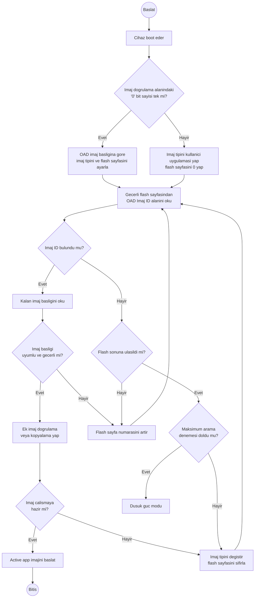

# BIL304 HW3 - CC1352R Donanim Uyarlama Notu

Bu proje, donanim uzerinde OTA surecinin 3. is parcacigini gostermek icin
hazirlanmis iki Contiki-NG firmware imajindan olusur:

- `old-firmware`: cihaza aktif uygulama olarak yuklenir.
- `new-firmware`: aktif uygulama olarak degil, flash icindeki staging/data
  alanina kaydedilecek yeni imaj olarak paketlenir.

Bu README yalnizca odevin 3. kismi olan **CC1352R gercekleme ve donanim
uyarlama** sorularina cevap verir. Teknik dayanak olarak `MCU.pdf`
belgesindeki CC13x2/CC26x2 Technical Reference Manual kullanilmistir.

## Kaynak Dokuman Ozeti

`MCU.pdf` belgesinde kullanilan ana bolumler:

| MCU.pdf sayfasi | Kullanilan bilgi |
| ---: | --- |
| 69-70 | SRAM, flash, ROM ve seri bootloader ozeti |
| 310-311 | Program flash, SRAM ve CCFG bellek haritasi |
| 638-646 | VIMS, flash/cache/GPRAM, flash yazma/silme kurallari |
| 793-797 | ROM bootloader isleyisi ve paket protokolu |
| 811-835 | CCFG, bootloader ayarlari, erase ayarlari ve image-valid bilgisi |

Bu sayfalara gore CC1352R ailesinde:

- Ana cekirdek Arm Cortex-M4F mimarisindedir.
- Program flash bellegi `0x00000000` adresinden baslar.
- SRAM `0x20000000` adresinden baslar.
- CCFG, cihaz konfigurasyon alanidir ve uygulama tarafindan ayarlanir.
- ROM icinde seri bootloader bulunur.
- Flash yazma/silme islemleri sayfa/sektor sinirlari dikkate alinarak
  yapilmalidir.

Bu projede kullanilan yerlesim `hw3_layout.h` icinde tanimlidir.

## 1. CC1352R Bellek Kapasiteleri

`MCU.pdf` teknik referansina gore ilgili bellekler:

| Bellek | Kapasite | Rol |
| --- | ---: | --- |
| Flash | 352 KiB | Program kodu, sabit veriler ve kalici veri |
| SRAM | 80 KiB | Calisma zamani stack, heap ve tamponlar |
| Cache / GPRAM | 8 KiB | Flash cache veya genel amacli RAM |
| ROM | 255 KiB | Boot kodu, ROM fonksiyonlari ve seri bootloader |

Flash bellek 8 KiB'lik sayfalar halinde organize edilir. Bu nedenle staging,
metadata ve CCFG gibi alanlar 8 KiB sinirlarina hizalanmistir.

## 2. Bu Projedeki Flash Yerlesimi

`hw3_layout.h` dosyasindaki bolumleme:

| Alan | Baslangic | Bitis | Boyut | Kullanim |
| --- | ---: | ---: | ---: | --- |
| Active app | `0x00000000` | `0x0002FFFF` | 192 KiB | Calisan `old-firmware` |
| New image staging | `0x00030000` | `0x00051FFF` | 136 KiB | Paketlenmis `new-firmware` |
| Update metadata | `0x00052000` | `0x00053FFF` | 8 KiB | Imaj durumu, surum, CRC vb. |
| Recovery/reserved | `0x00054000` | `0x00055FFF` | 8 KiB | Kurtarma veya yedek amacli alan |
| CCFG flash sektoru | `0x00056000` | `0x00057FFF` | 8 KiB | Kritik cihaz konfigurasyonu |

Toplam:

```text
192 KiB + 136 KiB + 8 KiB + 8 KiB + 8 KiB = 352 KiB
```

Bu yerlesim cihazdaki 352 KiB flash kapasitesini tam olarak kapsar.

## 3. Uygulamanin Calisan Ana Imaji Nereye Yerlesir?

Ana uygulama `0x00000000` adresinden baslayan active app alanina yerlesir.
Bu projede aktif calisan firmware `old-firmware` dosyasidir.

Neden `0x00000000`?

- Arm Cortex-M tabanli sistemlerde reset sonrasi vektor tablosu flash basindan
  okunur.
- CCFG icindeki image-valid ayari, ROM boot kodunun hangi flash imajina kontrol
  devredecegini belirler.
- Standart flash imajlarinda vektor tablosu genellikle `0x00000000`
  adresindedir.

Bu nedenle `old-firmware.hex`, UniFlash ile aktif uygulama olarak yazilacak
dosyadir.

## 4. Diske Kaydedilecek Yeni Imaj Hangi Alana Yazilir?

Yeni firmware aktif uygulama olarak yazilmaz. Bu projede yeni imaj staging
alanina yazilir:

```text
0x00030000 - 0x00051FFF
```

Bu alan `HW3_NEW_IMAGE_BASE` ve `HW3_NEW_IMAGE_SIZE` ile tanimlidir.
`new-firmware` once binary hale getirilir, sonra `tools/package_cc1352r_image.py`
ile baslik bilgisi eklenmis container dosyasina donusturulur.

Container yapisi:

```text
[FwImageHeader][new-firmware payload]
```

Header icinde surum, hedef adres, imaj boyutu, imaj CRC32 ve header CRC bilgisi
tutulur. Boylece staging alanindaki veri sadece rastgele byte dizisi degil,
kontrol edilebilir bir firmware paketi olur.

## 5. Ayni Anda Iki Tam Imaj Saklanabiliyor mu?

Genel cevap: Hayir, CC1352R uzerinde iki adet maksimum boyutlu tam firmware
imajini ayni anda saklamak mumkun degildir.

Bu projedeki cevap:

- Aktif imaj icin 192 KiB ayrildi.
- Yeni imaj staging alani icin 136 KiB ayrildi.
- Metadata, recovery ve CCFG icin toplam 24 KiB ayrildi.

Bu nedenle ayni anda iki imaj saklama fikri ancak imaj boyutlari bu sinirlara
uyuyorsa mumkundur. `new-firmware` imaji staging alanina sigmazsa paketleme
script'i hata verir.

## 6. Sadece Staging Alani Varsa Aktivasyon Nasil Yapilir?

Sadece staging alani, yeni imajin saklanmasi icin yeterlidir; fakat yeni imajin
otomatik olarak calistirilmasi icin yeterli degildir.

Aktivasyon icin ayrica bir bootloader/BIM veya kopyalama mekanizmasi gerekir:

1. Reset sonrasi boot kodu veya ozel bootloader calisir.
2. Metadata alaninda yeni imaj var mi diye bakar.
3. Staging alanindaki header, boyut ve CRC bilgilerini dogrular.
4. Imaj gecerliyse aktif uygulama alanini uygun sekilde siler.
5. Staging alanindaki yeni imaji active app alanina kopyalar.
6. Metadata durumunu gunceller.
7. Reset atarak veya active app reset vektorune gecerek cihazi yeni firmware
   ile baslatir.

Bu proje icin `new-firmware` execute-in-place staging imaji degildir.
`new-firmware` normal Cortex-M uygulamasi gibi `0x00000000` adresine
linklenir; bu nedenle `0x00030000` staging adresinden dogrudan calistirilmaz.

Bu projede `new-firmware.container.hex` staging alanina yazilir, ancak mevcut
kod tek basina yeni imaji boot etmez. Bu davranis odev kapsaminda bilincli bir
donanim uyarlama kararidir.

## 7. Boot Zinciri Akis Diyagrami

Asagidaki akista, paylasilan BIM secim diyagrami Turkcelestirilerek
gosterilmistir:



Tam firmware degisimi istenirse bu akisa staging imajini dogrulayan ve aktif
alana tasiyan bir bootloader/BIM adimi eklenmelidir.

## 8. Boot Surecinde ROM Bootloader ve CCFG'nin Rolu

ROM bootloader:

- Cihazin ROM'unda hazir bulunur.
- UART veya SSI uzerinden flash imaji indirme/yukleme amaciyla kullanilir.
- Gecerli flash imaji yoksa veya bootloader backdoor kosulu saglanirsa devreye
  girebilir.
- Uygulama kodundan dogrudan cagrilacak genel bir firmware switch mekanizmasi
  degildir.

CCFG:

- Uygulama tarafindan derleme zamaninda ayarlanan musteri konfigurasyon alanidir.
- Bootloader enable/backdoor ayarlarini tutar.
- JTAG/TAP/DAP erisim izinlerini tutar.
- Image-valid bilgisini tutar.
- Flash koruma ve erase davranislarini etkiler.

Bu nedenle CCFG yanlis silinirse veya bozulursa cihaz boot edemeyebilir, debug
erisimi kisitlanabilir veya bootloader davranisi beklenenden farkli hale
gelebilir.

## 9. CCFG Alani Neden Kritiktir?

CCFG, son flash sayfasinda yer alan kritik konfigurasyon bilgisidir. Bu projede
son 8 KiB alan CCFG icin ayrilmistir:

```text
0x00056000 - 0x00057FFF
```

Bu alanin kritik olma nedenleri:

- ROM boot kodunun flash imajini gecerli saymasinda rol oynar.
- Bootloader'in acik/kapali olmasini etkiler.
- Bootloader backdoor pin kosulunu belirleyebilir.
- Chip erase ve bank erase davranislarini etkileyebilir.
- Debug/JTAG erisim izinlerini etkileyebilir.
- Flash sektor koruma bitleri bu alanla iliskilidir.

Bu yuzden `new-firmware.container.hex` yuklenirken **mass erase/full chip erase
yapilmamalidir**. Staging dosyasi yalnizca `0x00030000` adresinden baslayan
alana programlanmalidir.

ELF analizinde `.ccfg` section'i flash'in son sayfasinda, `0x00057fa8`
civarinda gorunur. Bu section update payload'una dahil edilmemeli ve active
app kopyalama islemi sirasinda uzerine yazilmamalidir.

## 10. Flash Erase/Write Islemleri Neden Dikkatli Planlanmali?

Flash bellek RAM gibi byte byte serbestce yazilamaz.

CC1352R icin onemli noktalar:

- Flash 8 KiB sayfalar halinde silinir.
- Silme islemi ilgili sayfadaki bitleri `1` durumuna getirir.
- Programlama islemi bitleri genellikle `1 -> 0` yonunde degistirir.
- Ayni flash satirina erase olmadan sinirli sayida yazma yapilabilir.
- Flash programlama/erase sirasinda flash'tan kod calistirmak tehlikelidir;
  gerekirse yazma rutini SRAM'den calistirilmelidir.
- VIMS cache/line buffer durumu flash guncelleme sirasinda dikkate alinmalidir.

Bu nedenle aktif `old-firmware` calisirken aktif uygulama alanini silmek yanlis
bir stratejidir. Yeni imaj once staging alanina yazilmali, sonra guvenilir bir
bootloader tarafindan dogrulanip aktiflestirilmelidir.

## 11. RAM Kisitlari ve Tampon Boyutlandirma

CC1352R 80 KiB SRAM'e sahiptir. Bu RAM ayni anda isletim sistemi, stack, heap,
ag tamponlari ve uygulama degiskenleri tarafindan kullanilir.

Bu nedenle yeni firmware imajinin tamamini RAM'e almak dogru degildir. Daha
guvenli strateji:

- Imaj kucuk bloklar halinde islenir.
- Blok boyutu flash row/page sinirlari ve ag paketi boyutlari dikkate alinarak
  secilir.
- Ornek tampon boyutlari: 256 B, 512 B veya 1024 B.
- Tumuyle RAM'de tutmak yerine staging flash alanina parcali yazilir.
- En sonda tum imaj CRC32 ile dogrulanir.

Bu projede donanim gosterimi icin yeni imaj UniFlash ile staging alanina
onceden yazilir. OTA aktarim yapilmadigi icin RAM tamponu tasarimi kodda tam
aktarim mekanizmasi olarak kullanilmamistir; ancak gercek OTA uygulamasinda
zorunlu hale gelir.

## 12. Tam Firmware Degisimi Neden Bootloader Gerektirir?

Calisan uygulama kendi bulundugu flash alanini silip yeniden yazmaya calisirsa
su riskler ortaya cikar:

- CPU silinen veya yazilan flash bolgesinden kod okumaya calisabilir.
- Kesme vektorleri ve reset handler bozulabilir.
- Guc kesilirse cihaz yarim yazilmis imajla kalabilir.
- CCFG veya koruma alanlari yanlislikla silinebilir.
- Yeni imajin CRC/dogrulama sonucu boot oncesi garanti edilemez.

Bu nedenle tam firmware degisiminde bootloader/BIM gerekir. Bootloader,
uygulamadan bagimsiz ve kucuk bir guvenilir kod parcasi olarak:

- staging imajini dogrular,
- aktif uygulama alanini kontrollu siler,
- yeni imaji staging alanindan active app alanina kopyalar,
- basarisizlikta eski imaja veya recovery stratejisine donebilir.

Bu projedeki `old-firmware` ve `new-firmware` ayrimi, bu gereksinimi gostermek
icin tasarlanmistir.

## 13. Bu Projedeki Firmware Rolleri

### old-firmware

`old-firmware.c` aktif uygulamadir. Baslangicta:

- eski firmware surumunu loglar,
- active app, staging, metadata ve CCFG adreslerini loglar,
- staging alaninda `FwImageHeader` var mi diye bakar,
- header CRC ve payload CRC kontrolu yapar,
- gecerli imaj varsa bunun BIM tarafindan aktiflenebilir oldugunu loglar,
- yesil LED'i yakar,
- her saniye terminale saniye sayaci ile log basar.

### new-firmware

`new-firmware.c` yeni firmware imajidir. Bu dosya dogrudan aktif uygulama
olarak flash'lanmaz. Derlendikten sonra binary hale getirilir ve staging
container dosyasina donusturulur.

## 14. Derleme

Bu klasor Contiki-NG agaci altinda olmalidir. Onerilen konum:

```sh
contiki-ng/examples/bil304-hw3
```

`Makefile` icindeki `CONTIKI` yolu bu konuma gore ayarlanir:

```makefile
CONTIKI ?= ../..
```

Derleme:

```sh
make TARGET=simplelink BOARD=sensortag/cc1352r1 old-firmware new-firmware
```

Eger proje Contiki-NG disinda duruyorsa `CONTIKI` degiskeni dogrudan gercek
Contiki-NG yolunu gostermelidir:

```makefile
CONTIKI = C:/path/to/contiki-ng
```

## 15. UniFlash ile Yukleme Sirasi

### 1. old-firmware aktif imajini hazirla

```sh
arm-none-eabi-objcopy -O ihex \
  build/simplelink/sensortag/cc1352r1/old-firmware.simplelink \
  build/simplelink/sensortag/cc1352r1/old-firmware.hex
```

UniFlash ile `old-firmware.hex` dosyasini normal aktif uygulama olarak cihaza
yukle.

### 2. new-firmware binary dosyasini uret

```sh
arm-none-eabi-objcopy -O binary \
  --only-section=.resetVecs \
  --only-section=.text \
  --only-section=.rodata \
  --only-section=.data \
  --only-section=vtable_ram \
  --only-section=.ARM.exidx \
  build/simplelink/sensortag/cc1352r1/new-firmware.simplelink \
  build/simplelink/sensortag/cc1352r1/new-firmware.bin
```

Bu komut yalnizca uygulamanin flash'ta tasinmasi gereken load section'larini
alir. `.data` ve `vtable_ram` RAM'de calisan section'lar olsa da baslangic
icerikleri flash'taki load image icinde tutuldugu icin payload'a dahil edilir.
`.ccfg`, debug, symbol ve comment section'lari staging payload'una konmaz.

Duz `objcopy -O binary` kullanilirsa `.ccfg` section'i yuzunden raw binary
flash sonuna kadar uzayabilir. Paketleme script'i aktif uygulama sinirinin
disindaki bytelari paketlemez; yine de yukaridaki section filtreli komut daha
acik ve denetlenebilir bir cikti verir.

### 3. new-firmware staging container dosyasini uret

Windows'ta:

```sh
python tools/package_cc1352r_image.py \
  build/simplelink/sensortag/cc1352r1/new-firmware.bin \
  --version 0x00020000 \
  --out-bin build/simplelink/sensortag/cc1352r1/new-firmware.container.bin \
  --out-hex build/simplelink/sensortag/cc1352r1/new-firmware.container.hex
```

Linux/macOS ortaminda `python3` kullanilabilir.

### 4. staging alanini programla

UniFlash ile `new-firmware.container.hex` dosyasini yukle.

Kritik notlar:

- Bu dosya aktif uygulama olarak yuklenmez.
- Baslangic adresi container HEX icinde `0x00030000` olarak bulunur.
- Header icindeki hedef adres `0x00000000` olur.
- BIM/recovery staging adresine jump etmez; payload'u active app alanina
  kopyalayip resetler veya active reset vektorune gecer.
- Full chip erase / mass erase yapilmaz.
- CCFG bolgesi korunur.

## 16. Odevin Pesinden Gidilecek Sorularina Kisa Cevaplar

**Uygulamanin calisan ana imaji nereye yerlesecek?**

`0x00000000 - 0x0002FFFF` araligindaki active app alanina yerlesir.

**Diske kaydedilecek yeni imaj hangi alana yazilacak?**

`0x00030000 - 0x00051FFF` araligindaki staging alanina yazilir.

**Ayni anda iki tam imaj saklanabiliyor mu?**

Maksimum boyutlu iki tam imaj saklanamaz. Bu projede aktif imaj 192 KiB, staged
imaj ise en fazla yaklasik 136 KiB olacak sekilde sinirlandirilmistir.

**Sadece staging alani varsa aktivasyon nasil yapilacak?**

Staging tek basina aktivasyon yapmaz. Header/CRC dogrulamasi yapan ve yeni
imaji aktif alana tasiyan bootloader/BIM gerekir.

**Flash sektor silme ve yazma islemleri mevcut calisan imaji nasil etkileyebilir?**

Aktif imajin bulundugu sayfa silinirse calisan kod, vektor tablosu veya sabit
veriler bozulur. Bu nedenle yazma/silme islemleri staging gibi ayrilmis
alanlara yapilmali ve aktif imaj ancak bootloader kontrolunde degistirilmelidir.

## 17. Mevcut Sinirlar

Bu proje yeni firmware'i staging alanina koyma stratejisini gosterir. Tek basina
sunlari yapmaz:

- staging imajini otomatik boot etmez,
- aktif firmware'i staging imaji ile degistirmez,
- guc kesintisine dayanikli A/B boot sistemi uygulamaz.

Bu eksikler, tam firmware degisimi icin neden bootloader/BIM gerektigini
gosteren odev cevabinin bir parcasidir.
