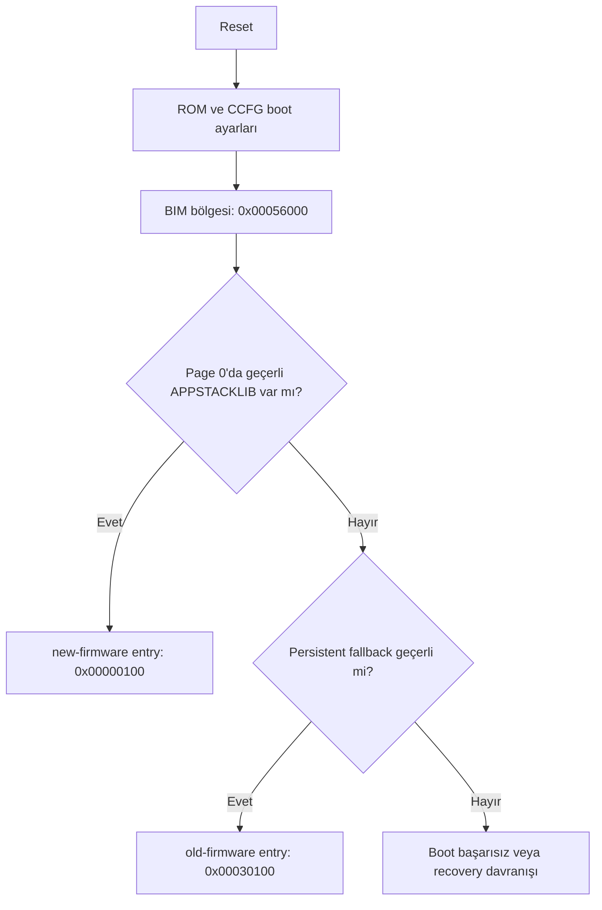
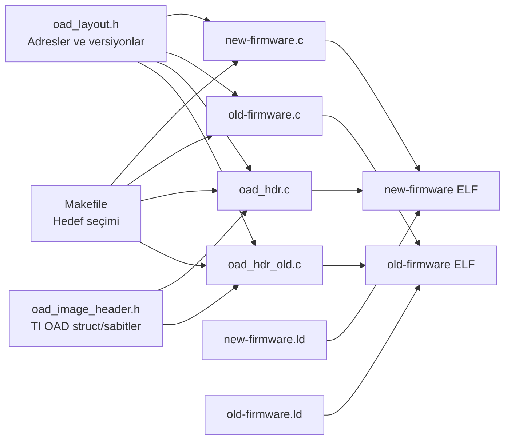

<div align="center">


<h1>BIL304 HW3 - 3. Aşama</h1>

<p>
  
  
  
  
</p>

<p>
  <b>CC1352R Gerçekleme ve Donanım Uyarlama Görevi</b>
</p>

<p>
  Mevcut BIM korunur | User firmware page 0 | Persistent fallback 0x30000
</p>

</div>

Bu depo, ödevin yalnızca **3. CC1352R Gerçekleme ve Donanım Uyarlama**
kısmı için hazırlanmıştır. Amaç, Contiki-NG ile derlenen iki firmware imajını
CC1352R flash yerleşimine uyarlamak ve mevcut TI BIM/OAD akışıyla çalışabilecek
şekilde doğrulamaktır.

Bu çalışmada BIM dosyası değiştirilmez. Firmware tarafındaki linker script,
OAD header ve flash adresleri mevcut BIM'in arama sırasına göre düzenlenir.

## Kapsam

Yapılanlar:

- `new-firmware`, user imaj olarak page 0'a yerleştirildi.
- `old-firmware`, persistent fallback imaj olarak `0x00030000` slotuna yerleştirildi.
- Her iki imaj için TI OAD uyumlu image header eklendi.
- Linker scriptlerde OAD header, reset vector, DMA, stack ve RAM bölgeleri düzenlendi.
- ELF section ve OAD header içerikleri `readelf` / `objdump` ile doğrulanabilir hale getirildi.

Kapsam dışı:

- BIM kaynak kodunu değiştirmek.
- Yeni bootloader yazmak.
- Release/secure OAD imzalama ve CRC paketleme akışını otomatikleştirmek.

## Bellek Yerleşimi

CC1352R için temel bellek alanları:

| Bellek | Adres Aralığı | Kullanım |
| --- | ---: | --- |
| Flash | `0x00000000 - 0x00057FFF` | Uygulama imajları, OAD header, BIM ve CCFG |
| SRAM | `0x20000000 - 0x20013FFF` | Çalışma zamanı veri, stack, bss ve DMA tabloları |
| GPRAM | `0x11000000 - 0x11001FFF` | Cache/GPRAM bölgesi |
| ROM | Cihaz içinde sabit | TI ROM boot kodu ve yardımcı rutinler |

Flash içindeki firmware yerleşimi:

| Alan | Başlangıç | Bitiş | Görev |
| --- | ---: | ---: | --- |
| User image | `0x00000000` | `0x0002FFFF` | BIM'in ilk aradığı `APPSTACKLIB` imaj |
| Persistent fallback | `0x00030000` | `0x00051FFF` | User imaj yoksa veya geçersizse fallback |
| Metadata | `0x00052000` | `0x00053FFF` | Ayrılmış alan |
| Recovery | `0x00054000` | `0x00055FFF` | Ayrılmış alan |
| BIM + CCFG | `0x00056000` | `0x00057FFF` | Mevcut TI BIM ve CCFG |

Her imaj slotunun ilk `0x100` byte'ı OAD image header için ayrılır.
Reset vector tablosu header alanından sonra başlar.

| İmaj | Header | Entry / Reset Vector | Image Type |
| --- | ---: | ---: | --- |
| `new-firmware` | `0x00000000` | `0x00000100` | `APPSTACKLIB` |
| `old-firmware` | `0x00030000` | `0x00030100` | `PERSISTENT_APP` |

## Boot Akışı

Mevcut BIM şu sırayla imaj arar:



Beklenen davranış:

- `new-firmware` çalışıyorsa kırmızı LED heartbeat verir.
- `old-firmware` çalışıyorsa yeşil LED heartbeat verir.

## Kod Dosyaları

Bu bölüm, repodaki dosyaların derleme ve çalışma zamanındaki görevlerini özetler.

| Dosya | Görev | Derleme / çalışma etkisi |
| --- | --- | --- |
| `new-firmware.c` | Ana user firmware uygulaması. Contiki process başlatır, firmware versiyonunu ve slot bilgisini loglar, kırmızı LED'i periyodik olarak değiştirir. | `new-firmware` hedefi derlenirken uygulama kodu olarak alınır. BIM geçerli user imajı seçerse `0x00000100` entry adresinden çalışır. |
| `old-firmware.c` | Persistent fallback uygulaması. Fallback slotunun seçildiğini loglar, flash yerleşimini yazar, yeşil LED heartbeat üretir. | `old-firmware` hedefi derlenirken uygulama kodu olarak alınır. User imaj geçersizse BIM bu imaja `0x00030100` adresinden geçer. |
| `oad_hdr.c` | User imaj için `_imgHdr` OAD image header nesnesini tanımlar. | `.image_header` section'ına yerleşir. `imgType = APPSTACKLIB`, `prgEntry = 0x00000100`, `startAddr = 0x00000000` değerlerini üretir. |
| `oad_hdr_old.c` | Persistent fallback imaj için `_imgHdr` OAD image header nesnesini tanımlar. | `.image_header` section'ına yerleşir. `imgType = PERSISTENT_APP`, `prgEntry = 0x00030100`, `startAddr = 0x00030000` değerlerini üretir. |
| `oad_image_header.h` | TI OAD header alanları için sabitleri ve packed struct tanımlarını içerir. | Header alanının bellek düzeninin TI BIM'in beklediği sırada oluşmasını sağlar. |
| `oad_layout.h` | Flash slot adresleri, header boyutu, entry adresleri ve firmware versiyonlarını merkezi olarak tanımlar. | Hem uygulama logları hem de OAD header kaynakları aynı adresleri kullanır; adres tutarsızlığını önler. |
| `new-firmware.ld` | User imaj linker scriptidir. | Header'ı `0x00000000`, reset vector'ı `0x00000100` adresine yerleştirir. `.ccfg` section'ını discard ederek BIM/CCFG alanını korur. |
| `old-firmware.ld` | Persistent fallback linker scriptidir. | Header'ı `0x00030000`, reset vector'ı `0x00030100` adresine yerleştirir. |
| `Makefile` | Contiki-NG derleme kurallarını, hedef seçimini ve yükleme dosyası üretimini yönetir. | Aynı anda iki imaj derlenmesini engeller; hedefe göre doğru OAD header dosyasını ekler, `upload-files` ile `.hex` / `.bin` üretir. |
| `project-conf.h` | Proje seviyesinde Contiki ayarları içerir. | Log seviyesini ayarlar. |
| `LICENSE` | Lisans bilgisidir. | Kaynak kodun kullanım koşullarını belirtir. |

## Dosyalar Arası İlişki



## Derleme

Contiki-NG `LDSCRIPT` değişkenini global kullandığı için iki imaj ayrı ayrı
derlenmelidir. `Makefile` bu yüzden aynı anda hem `old-firmware` hem de
`new-firmware` hedefinin derlenmesini engeller.

User imaj:

```sh
make TARGET=simplelink BOARD=sensortag/cc1352r1 LDSCRIPT=new-firmware.ld new-firmware
```

Persistent fallback imaj:

```sh
make TARGET=simplelink BOARD=sensortag/cc1352r1 LDSCRIPT=old-firmware.ld old-firmware
```

`CONTIKI ?= ../..` değeri, bu klasörün Contiki-NG kaynak ağacına göre
konumlandırıldığını varsayar. Proje farklı bir yerdeyse derleme sırasında
`CONTIKI=/path/to/contiki-ng` verilebilir.

## Yükleme Dosyalarının Üretimi

Cihaza yazmak için ELF çıktısından `.hex` veya `.bin` dosyası üretilir. Bu
projede bunun için `Makefile` içine `upload-files` hedefi eklendi.

```sh
make TARGET=simplelink BOARD=sensortag/cc1352r1 upload-files
```

Bu komut sırasıyla şunları yapar:

1. `new-firmware` imajını `new-firmware.ld` ile derler.
2. `old-firmware` imajını `old-firmware.ld` ile derler.
3. Her iki ELF çıktısını `arm-none-eabi-objcopy` ile `.hex` ve `.bin` formatına çevirir.
4. Dosyaları `upload/` klasörüne koyar.

Üretilen firmware dosyaları:

| Dosya | İçerik | Yükleme adresi |
| --- | --- | ---: |
| `upload/new-firmware.hex` | User firmware, OAD header dahil | Adres HEX içinde gömülü |
| `upload/new-firmware.bin` | User firmware raw binary | `0x00000000` |
| `upload/old-firmware.hex` | Persistent fallback firmware, OAD header dahil | Adres HEX içinde gömülü |
| `upload/old-firmware.bin` | Persistent fallback raw binary | `0x00030000` |

`arm-none-eabi-objcopy` PATH içinde değilse komut şu şekilde çalıştırılabilir:

```sh
make TARGET=simplelink BOARD=sensortag/cc1352r1 OBJCOPY=/path/to/arm-none-eabi-objcopy upload-files
```

Yükleme için mümkünse `.hex` dosyaları tercih edilmelidir. HEX formatı adres
bilgisini taşıdığı için `new-firmware` ve `old-firmware` doğru flash slotlarına
yerleşir. `.bin` dosyaları raw çıktıdır; programlama aracında başlangıç adresi
elle verilmelidir.

## Derleme Akışı

Derleme komutu çalıştığında işlem özetle şu sırayla ilerler:


Kısaca:

1. `Makefile`, verilen hedefe bakar.
2. Hedef `new-firmware` ise `oad_hdr.c`, hedef `old-firmware` ise `oad_hdr_old.c` derlemeye eklenir.
3. `LDSCRIPT` ile seçilen linker script flash başlangıç adreslerini belirler.
4. C dosyaları object dosyalarına çevrilir.
5. Link aşamasında `.image_header`, `.resetVecs`, `.text`, `.data`, `.bss`, `.stack` ve DMA alanları doğru adreslere yerleştirilir.
6. Çıkan ELF dosyası `readelf` ve `objdump` ile kontrol edilir.
7. `upload-files` hedefi kullanıldıysa ELF dosyalarından `.hex` ve `.bin` yükleme çıktıları üretilir.
8. Programlama yapılırken sadece ilgili flash slotları yazılır; BIM/CCFG alanı korunur.

## Doğrulama

Section adreslerini kontrol etmek için:

```sh
arm-none-eabi-readelf -S build/simplelink/sensortag/cc1352r1/new-firmware.simplelink
arm-none-eabi-readelf -S build/simplelink/sensortag/cc1352r1/old-firmware.simplelink
```

Beklenen:

```text
new-firmware: .image_header 0x00000000, .resetVecs 0x00000100
old-firmware: .image_header 0x00030000, .resetVecs 0x00030100
```

OAD header içeriğini kontrol etmek için:

```sh
arm-none-eabi-objdump -s -j .image_header build/simplelink/sensortag/cc1352r1/new-firmware.simplelink
arm-none-eabi-objdump -s -j .image_header build/simplelink/sensortag/cc1352r1/old-firmware.simplelink
```

Kontrol edilen temel alanlar:

```text
new-firmware:
  magic     = CC13x2R1
  imgType   = 0x07
  prgEntry  = 0x00000100
  startAddr = 0x00000000

old-firmware:
  magic     = CC13x2R1
  imgType   = 0x00
  prgEntry  = 0x00030100
  startAddr = 0x00030000
```

## Cihaza Yükleme

Full chip erase yapılmamalıdır; BIM/CCFG bölgesi korunmalıdır.

Yükleme için gereken dosyalar:

| Dosya | Kaynak | Not |
| --- | --- | --- |
| `../bim_onchip/Debug_unsecure/bim_onchip.hex` | TI BIM projesi | BIM ve CCFG alanını içerir. |
| `upload/new-firmware.hex` | Bu projenin `upload-files` hedefi | Ana user firmware imajıdır. |
| `upload/old-firmware.hex` | Bu projenin `upload-files` hedefi | Persistent fallback firmware imajıdır. |

Yükleme sırası:

```text
1. BIM             -> 0x00056000 - 0x00057FFF
2. new-firmware    -> 0x00000000 - 0x0002FFFF
3. old-firmware    -> 0x00030000 - 0x00051FFF
```

BIN dosyasıyla yükleme yapılacaksa adresler ayrıca verilmelidir:

```text
upload/new-firmware.bin -> 0x00000000
upload/old-firmware.bin -> 0x00030000
```

HEX dosyalarıyla yükleme yapılırsa adresler dosyanın içinde bulunduğu için
programlama aracında ek başlangıç adresi verilmesi gerekmez.

## CCFG Notu

CCFG, reset sonrası cihaz davranışını ve boot zincirini etkileyen kritik flash
alanıdır. Bu projede BIM + CCFG bölgesi son sektörde tutulur:

```text
0x00056000 - 0x00057FFF
```

Bu bölge yanlışlıkla silinirse cihaz beklenen BIM akışına giremeyebilir.
Bu yüzden yükleme yaparken full chip erase yerine bölge bazlı programlama
kullanılmalıdır.

## İkinci Firmware Stratejisi

Mevcut BIM değiştirilmediği için ikinci imaj için ayrı bir flash slotu kullanılır.
Bu çalışmada `0x00030000 - 0x00051FFF` aralığı persistent fallback imaj için
ayrılmıştır. Böylece page 0'daki user imaj çalışmazsa BIM bu fallback imaja
geçebilir.

Tam firmware değiştirme veya staging alanındaki imajı aktif alana kopyalama gibi
işlemler için ek bootloader/recovery mantığı gerekir. Bu çalışmada yeni bootloader
yazılmamış, mevcut TI BIM/OAD modeli kullanılmıştır.

## Sorular ve Cevaplar

Bu bölüm, ödevde istenen soruların güncel TI/Contiki kaynaklarına göre kısa
cevaplarıdır.

| Soru | Cevap |
| --- | --- |
| Uygulamanın çalışan ana imajı nereye yerleşecek? | Mevcut BIM önce page 0'da user image aradığı için `new-firmware` `0x00000000` adresine yerleşir. Entry adresi `0x00000100` olur. |
| Diske/flash'a kaydedilecek ikinci imaj hangi alana yazılacak? | Bu çalışmada ikinci imaj için internal flash'ta `0x00030000 - 0x00051FFF` aralığı ayrıldı. Burada `old-firmware` persistent fallback imajı tutulur. |
| Aynı anda iki tam imaj saklanabiliyor mu? | Bu örnek imajlar küçük olduğu için evet. TI on-chip OAD dokümanı ise bunun flash yerleşimine ve user uygulamanın yeterince küçük olmasına bağlı olduğunu belirtir. |
| Sadece staging alanı varsa aktivasyon nasıl yapılır? | Staging imajı doğrudan seçilmeyecekse BIM/bootloader/recovery kodu tarafından doğrulanıp aktif alana kopyalanmalı veya OAD header üzerinden seçilebilir hale getirilmelidir. Bu projede mevcut BIM'e uyumlu iki seçilebilir slot kullanıldı. |
| Flash erase/write işlemleri mevcut çalışan imajı nasıl etkiler? | Flash silme işlemi sektör bazlıdır. Çalışan imajın veya BIM/CCFG alanının bulunduğu sektör silinirse cihaz boot edemeyebilir. Bu yüzden full chip erase yerine bölge bazlı programlama kullanılır. |

## Beklenen Çıktılar

Ödevin 3. kısmı için beklenen teknik çıktılar bu repoda şu şekilde karşılanır:

| Beklenen çıktı | Repodaki karşılığı |
| --- | --- |
| Flash ve RAM kullanımını gösteren bellek tablosu | `Bellek Yerleşimi` bölümü ve `oad_layout.h` |
| Boot zincirini gösteren kısa akış diyagramı | `Boot Akışı` bölümü |
| CCFG alanının neden kritik olduğu | `CCFG Notu` bölümü |
| İkinci firmware kaydı için yerleşim stratejisi | `İkinci Firmware Stratejisi` bölümü |
| Tam firmware değiştirme için neden bootloader gerektiği | Staging/aktivasyon açıklaması ve mevcut BIM/OAD seçimi |
| ELF/section doğrulaması | `readelf` ve `objdump` komutlarıyla `.image_header`, `.resetVecs`, OAD header alanları |
| Cihaza yüklenecek dosyaların üretimi | `make ... upload-files` hedefiyle `upload/*.hex` ve `upload/*.bin` dosyaları |

## Not

Debug BIM denemesinde OAD header içindeki `crc32`, `len`, `imgEndAddr` ve segment
length alanlarının `0xFFFFFFFF` kalması kabul edilebilir. Release veya secure OAD
akışı için bu alanlar TI OAD Image Tool ile doldurulmalıdır.

## Kaynaklar

- TI CC1352R ürün sayfası: https://www.ti.com/product/CC1352R
- TI CC1352R datasheet: https://www.ti.com/lit/ds/symlink/cc1352r.pdf
- TI güncel BIM dokümanı: https://software-dl.ti.com/simplelink/esd/simplelink_cc13xx_cc26xx_sdk/latest/exports/docs/ble5stack/ble_user_guide/html/oad-secure/bim.html
- TI güncel OAD image header dokümanı: https://software-dl.ti.com/simplelink/esd/simplelink_cc13xx_cc26xx_sdk/latest/exports/docs/ble5stack/ble_user_guide/doxygen/oad/html/group___o_a_d___i_m_a_g_e___h_e_a_d_e_r.html
- TI SimpleLink CC13xx/CC26xx SDK OAD girişi: https://software-dl.ti.com/simplelink/esd/simplelink_cc13xx_cc26xx_sdk/8.32.00.07/exports/docs/dmm/dmm_user_guide/html/oad-secure/intro.html
- TI ROM bootloader / CCFG notları: https://www.ti.com/lit/an/swra466e/swra466e.pdf
- Contiki-NG SimpleLink platform dokümanı: https://docs.contiki-ng.org/en/master/doc/platforms/simplelink.html
