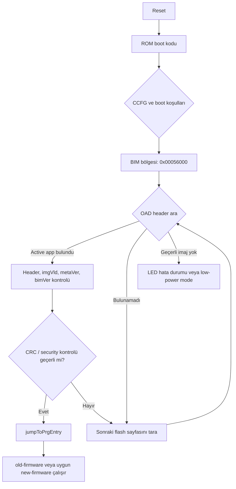

<div align="center">


<h1>BIL304 HW3 - CC1352R On-chip BIM ve Staging Firmware Yerleşimi</h1>

<p>
  
  
  
  
  
</p>

<p>
  <b>CC1352R üzerinde eski firmware, yeni staged firmware, BIM ve CCFG
  yerleşimini açıklayan donanım uyarlama çalışması.</b>
</p>

<p>
  Aktif imaj yerleşimi | Staging stratejisi | On-chip BIM analizi |
  CCFG güvenliği | ELF/HEX/MAP incelemesi
</p>

<p>
  <a href="#3-aşama-kapsam-kontrolü">Kapsam</a> |
  <a href="#flash-yerleşimi">Flash Yerleşimi</a> |
  <a href="#derleme">Derleme</a> |
  <a href="#cc1352r-elf-ve-map-analizi">ELF Analizi</a> |
  <a href="#ti-bim-ile-yükleme-akışı">BIM Yükleme</a> |
  <a href="#kısa-cevaplar">Kısa Cevaplar</a>
</p>

</div>

## İçindekiler

- [3. Aşama Kapsam Kontrolü](#3-aşama-kapsam-kontrolü)
- [Projedeki Dosyalar](#projedeki-dosyalar)
- [Flash Yerleşimi](#flash-yerleşimi)
- [Mevcut Kodun Çalışma Mantığı](#mevcut-kodun-çalışma-mantığı)
- [İki Farklı Header Modeli](#iki-farklı-header-modeli)
- [Verilen BIM Dosyalarından Çıkan Sonuçlar](#verilen-bim-dosyalarından-çıkan-sonuçlar)
- [Bu Projede Hangi İmaj Nereye Yerleştirilir?](#bu-projede-hangi-imaj-nereye-yerlestirilir)
- [Derleme](#derleme)
- [CC1352R ELF ve Map Analizi](#cc1352r-elf-ve-map-analizi)
- [Paketleme Akışı](#paketleme-akışı)
- [TI BIM ile Yükleme Akışı](#ti-bim-ile-yükleme-akışı)
- [Boot Zinciri Akış Diyagramı](#boot-zinciri-akış-diyagramı)
- [Önemli Tasarım Ayrımı](#önemli-tasarım-ayrımı)
- [Kısa Cevaplar](#kısa-cevaplar)

## Genel Bakış

Bu proje, CC1352R üzerinde tam firmware değişiminin neden dikkatli bir flash
yerleşimi, imaj başlığı ve boot aşaması gerektirdiğini göstermek amacıyla
hazırlanmıştır.

Kapsam notu: Bu README ve bu depo yalnızca ödevin **3. aşaması olan CC1352R
gerçekleme ve donanım uyarlama** bölümünü hedefler. 1. aşamadaki Cooja OTA
aktarım geliştirmesi ve 2. aşamadaki MSP430/Z1 ELF araştırması bu çalışmanın
kapsamı dışındadır.

Kod tabanında iki ayrı kavram birlikte gösterilir:

1. `old-firmware`: Cihazda aktif çalışan eski uygulama.
2. `new-firmware`: Flash içindeki staging alanına yerleştirilecek yeni uygulama.
3. `tools/package_cc1352r_image.py`: Yeni uygulamayı ödev için tanımlanan
   `HW3` container başlığı ile paketleyen araç.
4. Verilen `bim_onchip.*` dosyaları: TI'nin on-chip BIM/OAD boot akışını
   gösteren gerçek Boot Image Manager örneği.

En önemli nokta şudur: Bu depo tek başına güç kesintisine dayanıklı, tam
otomatik bir OTA update sistemi değildir. Mevcut uygulama staging alanındaki
imajı doğrular ve bootloader/BIM gereksinimini gösterir; aktif uygulama alanını
silip yeni imajı kopyalama işlemini uygulama kodu yapmaz.

## 3. Aşama Kapsam Kontrolü

Bu README, yalnızca 3. aşama için istenen maddeleri aşağıdaki bölümlerde
cevaplar:

| Ödev beklentisi | README'deki karşılığı |
| --- | --- |
| Flash ve RAM kullanımını gösteren bellek yerleşim tablosu | `Flash Yerleşimi`, `bim_onchip.map`, `CC1352R ELF ve Map Analizi` bölümleri |
| Boot zincirini gösteren kısa akış | `TI BIM/OAD Header Modeli`, `bim_onchip_main.c`, `TI BIM ile Yükleme Akışı` bölümleri |
| CCFG alanının neden kritik olduğu | `BIM + CCFG son sektör`, `CCFG ve Son Sektör Neden Kritik?` bölümleri |
| Diske ikinci firmware kaydı için yerleşim stratejisi | `new-firmware`, `Paketleme Akışı`, `Önemli Tasarım Ayrımı` bölümleri |
| Tam firmware değişimi için bootloader gerekliliği | `Mevcut Kodun Çalışma Mantığı`, `Önemli Tasarım Ayrımı`, `Mevcut Sınırlar` bölümleri |
| Peşinden gidilecek sorular | En sonda `Kısa Cevaplar` bölümünde doğrudan cevaplanır |

## Projedeki Dosyalar

| Dosya | Görev |
| --- | --- |
| `old-firmware.c` | Aktif çalışan eski firmware. Bellek yerleşimini loglar, staging alanında `HW3` container header'ı arar, header CRC ve payload CRC kontrolü yapar. |
| `new-firmware.c` | Yeni firmware örneği. Çalıştırıldığında sürüm bilgisini loglar ve kırmızı LED'i iki saniyede bir toggle eder. |
| `hw3_layout.h` | CC1352R flash bölümlerini ve firmware sürümlerini tanımlar. |
| `hw3_image.h` | Ödev için kullanılan 48 byte'lık `HW3` staging container header formatını tanımlar. |
| `oad_hdr_old.c` | `old-firmware` için TI OAD tarzında image header yerleştirir. Entry/start adresi `0x00000000` değeridir. |
| `oad_hdr.c` | `new-firmware` için TI OAD tarzında image header yerleştirir. Mevcut kodda entry/start adresi `0x00030000` değeridir. |
| `new-firmware.ld` | `new-firmware` imajını staging adresi olan `0x00030000` bölgesine linklemek için kullanılan linker script'tir. Contiki-NG derlemesinde komut satırından `LDSCRIPT=new-firmware.ld` olarak verilmelidir. |
| `new-firmware.lds` | Daha geniş kapsamlı/generated linker script örneğidir. Mevcut `Makefile` tarafından kullanılmaz. |
| `tools/package_cc1352r_image.py` | Raw firmware binary'sini `[HW3 header][payload]` biçiminde container'a dönüştürür, CRC32 hesaplar ve `.bin`/Intel HEX çıktıları üretir. |
| `project-conf.h` | Contiki log seviyesini ayarlar. |
| `.project`, `Debug/.clangd/compile_commands.json` | CCS/Eclipse/clangd yardımcı dosyalarıdır. Firmware davranışının ana parçası değildir. |

## Flash Yerleşimi

`hw3_layout.h` içindeki yerleşim, CC1352R'nin 352 KiB flash kapasitesini temel
alır. Flash sayfa boyutu 8 KiB olarak kabul edilmiştir.

### CC1352R Bellek Kapasiteleri

3. aşama kapsamında hedeflenen CC1352R ailesinde temel bellekler aşağıdaki
şekilde ele alınmıştır:

| Bellek | Kapasite | Bu projedeki rol |
| --- | ---: | --- |
| Program flash | 352 KiB | Uygulama kodu, staging alanı, BIM ve CCFG |
| SRAM | 80 KiB | Çalışma zamanı stack, heap, Contiki veri yapıları ve tamponlar |
| Cache / GPRAM | 8 KiB | Flash cache veya genel amaçlı RAM olarak kullanılabilen alan |
| ROM | 255 KiB | ROM kodu, driver/boot yardımcıları ve seri ROM bootloader |

Uygulama kodu kalıcı olarak program flash içinde tutulur. Reset sonrasında CPU,
vektör tablosu ve reset handler üzerinden flash'taki uygulama veya BIM koduna
geçer. SRAM yalnızca çalışma zamanı verileri içindir; yeni firmware imajının
tamamını SRAM'e almak bu kapasite nedeniyle uygun değildir.

| Alan | Başlangıç | Bitiş | Boyut | Kullanım |
| --- | ---: | ---: | ---: | --- |
| Active app | `0x00000000` | `0x0002FFFF` | 192 KiB | Çalışan uygulama, yani `old-firmware` |
| New image staging | `0x00030000` | `0x00051FFF` | 136 KiB | Yeni firmware veya staging container |
| Update metadata | `0x00052000` | `0x00053FFF` | 8 KiB | Update durumu için ayrılmış alan; bu kodda aktif kullanılmaz |
| Recovery/reserved | `0x00054000` | `0x00055FFF` | 8 KiB | Kurtarma/yedekleme için ayrılmış alan; bu kodda aktif kullanılmaz |
| BIM + CCFG son sektör | `0x00056000` | `0x00057FFF` | 8 KiB | TI BIM kodu ve cihaz konfigürasyonu için korunması gereken son sektör |

Toplam:

```text
192 KiB + 136 KiB + 8 KiB + 8 KiB + 8 KiB = 352 KiB
```

`hw3_layout.h` son sektörü `HW3_CCFG_BASE = 0x00056000` olarak adlandırır.
Bu isim, ödev açısından "son kritik sektör" anlamında değerlendirilmelidir.
Verilen `bim_onchip.map` dosyasına göre gerçek CCFG yapısı tüm 8 KiB sektör
değil, yalnızca son 88 byte'lık bölgedir:

```text
FLASH_BIM   : 0x00056000 - 0x00057F53
FLASH_CERT  : 0x00057F54 - 0x00057F9F
FLASH_FNPTR : 0x00057FA0 - 0x00057FA3
FLASH_CCFG  : 0x00057FA8 - 0x00057FFF
```

Flash sayfa silme işlemi 8 KiB sektör seviyesinde yapıldığı için
`0x00056000 - 0x00057FFF` aralığının tamamı korunmalıdır. Bu sektör yanlışlıkla
silinirse hem BIM hem de CCFG bozulabilir.

## Mevcut Kodun Çalışma Mantığı

### 1. `old-firmware`

`old-firmware.c`, cihazda normal aktif uygulama gibi çalışır.

Başlangıçta:

- eski firmware sürümünü loglar: `HW3_OLD_FW_VERSION = 0x00010000`,
- active app, staging, metadata ve son sektör adreslerini loglar,
- staging alanında `struct hw3_image_header` olup olmadığını kontrol eder,
- header alanlarını ve CRC değerlerini doğrular,
- imaj geçerliyse bunun bir bootloader/BIM tarafından etkinleştirilebileceğini loglar,
- yeşil LED'i yakar,
- her saniye heartbeat logu basar.

Staging kontrolü yalnızca `CONTIKI_TARGET_SIMPLELINK` için otomatik olarak
açıktır. Diğer hedeflerde `HW3_CONF_ENABLE_STAGING_CHECK` varsayılan olarak
kapalıdır.

Kontrol edilen `HW3` header kuralları:

| Alan | Beklenen değer |
| --- | --- |
| `magic` | `0x46573352` |
| `header_size` | `48` |
| `layout_version` | `1` |
| `target` | `HW3_ACTIVE_APP_BASE`, yani `0x00000000` |
| `image_size` | `0 < image_size <= HW3_IMAGE_MAX_PAYLOAD_SIZE` |
| `header_crc` | Header'ın `header_crc` alanı sıfırlanarak hesaplanan CRC32 |
| `image_crc` | Payload üzerinden hesaplanan CRC32 |

Bu kontrol yalnızca doğrulama yapar. `old-firmware` aktif uygulama alanını
silmez, staging'deki imajı kopyalamaz ve yeni firmware'e kendisi geçiş yapmaz.

### 2. `new-firmware`

`new-firmware.c`, yeni firmware örneğidir.

Çalıştırıldığında:

- `HW3_NEW_FW_VERSION = 0x00020000` değerini loglar,
- staging ve active app adreslerini loglar,
- kırmızı LED'i iki saniyede bir toggle eder.

`new-firmware.ld` linker script'i, `new-firmware` imajını `0x00030000` adresine
linklemek için hazırlanmıştır. Contiki-NG build sisteminde bu script'in
gerçekten kullanılması için derleme komutunda `LDSCRIPT=new-firmware.ld`
verilmelidir. Ayrıca `oad_hdr.c` içindeki TI OAD header alanları da `prgEntry`
ve `startAddr` için `0x00030000` değerini kullanır.

Bu nedenle mevcut kaynak kod, TI BIM açısından staging bölgesinden doğrudan
geçiş yapılabilen bir imaj modeline yakındır. Buna karşılık
`tools/package_cc1352r_image.py` aracı, `target = 0x00000000` kabul ederek
"staging'den active app alanına kopyalanacak container" modelini anlatır.

Bu iki model aşağıda ayrıca açıklanmıştır.

## İki Farklı Header Modeli

Bu projede bilinçli olarak iki farklı imaj başlığı yaklaşımı gösterilmiştir.
Bu iki yaklaşım birbirine karıştırılmamalıdır.

### Model A - Ödev `HW3` Container Header'ı

Bu model `hw3_image.h`, `old-firmware.c` ve
`tools/package_cc1352r_image.py` tarafından kullanılır.

Container yapısı:

```text
0x00030000: [48 byte HW3 image header]
0x00030030: [new-firmware payload]
```

Header içinde:

- magic,
- layout version,
- firmware version,
- payload boyutu,
- payload CRC32,
- hedef adres,
- header CRC32

bilgileri bulunur.

Paketleme aracı varsayılan olarak:

```text
output HEX base : 0x00030000
target address  : 0x00000000
max payload     : HW3_NEW_IMAGE_SIZE - 48
```

kullanır.

Bu modelde staging alanındaki imaj doğrudan çalıştırılmaz. Önce bir bootloader
veya recovery kodu imajı doğrular, ardından payload'u active app alanına,
`0x00000000` adresine kopyalar. Bu projede söz konusu kopyalama kodu
uygulanmamıştır.

### Model B - TI BIM/OAD Header'ı

Bu model `oad_hdr_old.c`, `oad_hdr.c` ve verilen `bim_onchip_main.c` tarafından
temsil edilir.

TI BIM, flash sayfalarının başında TI OAD image header'ı arar. Header içinde:

- `imgID`,
- `bimVer`,
- `metaVer`,
- `imgType`,
- `imgVld`,
- `crcStat`,
- `crc32`,
- `len`,
- `prgEntry`,
- payload segment bilgileri

bulunur.

Verilen `bim_onchip_main.c` içindeki `Bim_findImage()` akışı şu kontrolleri
yapar:

1. İlgili flash sayfasından OAD image ID alanını okur.
2. `imgIDCheck()` ile imaj kimliğini kontrol eder.
3. İmaj tipi ve `imgVld` durumunu kontrol eder.
4. `bimVer`, `metaVer` ve `crcStat` alanlarını denetler.
5. Gerekirse CRC32 hesaplayıp `crcStat` alanını günceller.
6. Security açıksa imza ve SHA256 kontrollerini yapar.
7. Tüm kontroller geçerliyse `jumpToPrgEntry()` ile `prgEntry` adresine geçer.

Bu modelde BIM, `HW3` container header'ını okumaz. Bu nedenle
`tools/package_cc1352r_image.py` ile üretilen container dosyası TI BIM için
doğrudan beklenen format değildir.

## Verilen BIM Dosyalarından Çıkan Sonuçlar

Bu README hazırlanırken aşağıdaki dosyalar da incelenmiştir:

- `bim_onchip_main.c`
- `bim_onchip.map`
- `bim_onchip.hex`

### `bim_onchip_main.c`

Bu dosya, TI'nin on-chip OAD için kullandığı Boot Image Manager ana kodudur.
Kodun temel akışı:

```text
main()
  -> Flash sayfa boyutunu oku
  -> Önce OAD_IMG_TYPE_APPSTACKLIB tipinde uygulama imajı ara
  -> Bulunamazsa OAD_IMG_TYPE_PERSISTENT_APP tipinde persistent imaj ara
  -> Geçerli imaj bulunursa Bim_findImage() içinden prgEntry adresine geç
  -> Geçerli imaj yoksa LED hata durumuna veya low-power moda gir
```

`START_PAGE` CC13x2/CC26x2 ailesi için `0` olarak tanımlıdır. `APP_HDR_LOC`
verilmemişse BIM önce flash başlangıcından imaj aramaya başlar. Persistent imaj
için ise sonraki sayfaları tarar.

Bu BIM kodu, active app alanını silip staging'den kopyalama yapan bir copy
manager gibi davranmaz. Uygun OAD header'a sahip geçerli imajı bulur ve
`prgEntry` adresine geçer.

### `bim_onchip.map`

Map dosyası, derlenmiş BIM'in gerçek flash yerleşimini gösterir:

| Bölge | Origin | Length | Used |
| --- | ---: | ---: | ---: |
| `FLASH_BIM` | `0x00056000` | `0x00001F54` | `0x0000057C` |
| `FLASH_CERT` | `0x00057F54` | `0x0000004C` | `0x00000000` |
| `FLASH_FNPTR` | `0x00057FA0` | `0x00000004` | `0x00000000` |
| `FLASH_CCFG` | `0x00057FA8` | `0x00000058` | `0x00000058` |
| `SRAM` | `0x20000300` | `0x00013D00` | `0x00000100` |

Önemli semboller:

| Sembol | Adres | Anlam |
| --- | ---: | --- |
| `ResetISR` | `0x0005653D` | BIM reset handler girişi |
| `Bim_findImage` | `0x00056258` | İmaj arama/doğrulama fonksiyonu |
| `main` | `0x000564ED` | BIM ana akışı |
| `jumpToPrgEntry` | `0x00056547` | Geçerli imaja geçiş fonksiyonu |
| `OAD_IMG_ID` | `0x0005656C` | OAD imaj kimliği sabiti |

Bu bilgi `hw3_layout.h` yerleşimiyle uyumludur: son 8 KiB sektör
`0x00056000 - 0x00057FFF` aralığında ayrılmıştır.

### `bim_onchip.hex`

HEX dosyası Intel HEX formatındadır. İlk kayıt:

```text
:020000040005F5
```

extended linear address olarak `0x0005` üst adresini seçer. Hemen sonraki veri
kaydı `0x6000` offset'indedir. Bu iki kayıt birlikte ilk program adresinin
`0x00056000` olduğunu gösterir.

Dosyanın son tarafında `0x00057FA8` civarında CCFG kayıtları vardır. Bu durum,
map dosyasındaki `FLASH_CCFG = 0x00057FA8 - 0x00057FFF` sonucunu doğrular.
CCFG kayıtları boot davranışını belirlediği için ROM boot kodunun BIM'e
gidebilmesi bu bölgenin doğru programlanmasına bağlıdır.

Sonuç olarak `bim_onchip.hex` yüklenirken son 8 KiB sektör programlanır. Bundan
sonra `old-firmware.hex` veya `new-firmware.container.hex` yüklenirken full chip
erase yapılmamalıdır; aksi halde BIM ve CCFG silinebilir.

<a id="bu-projede-hangi-imaj-nereye-yerlestirilir"></a>

## Bu Projede Hangi İmaj Nereye Yerleştirilir?

### `old-firmware`

Aktif uygulama alanına yerleştirilir:

```text
0x00000000 - 0x0002FFFF
```

Bu alan, reset sonrasında çalışan ana uygulama alanıdır. `old-firmware`
içindeki OAD header da entry/start adresini `0x00000000` olarak tanımlar.

### `new-firmware`

Staging alanına yerleştirilir:

```text
0x00030000 - 0x00051FFF
```

Mevcut `new-firmware.ld` dosyası yeni firmware'i bu adrese linkler:

```ld
FLASH (RX) : ORIGIN = 0x00030000, LENGTH = 0x00022000
```

Mevcut `oad_hdr.c` de `prgEntry` ve `startAddr` değerlerini `0x00030000`
olarak ayarlar. Bu ayar, TI BIM'in geçerli OAD header bulduktan sonra staging
bölgesindeki imaja geçmesi senaryosu ile uyumludur.

Ancak `HW3` container modeli kullanılıyorsa header içindeki `target`
`0x00000000` olur. Bu durumda staging payload'u doğrudan çalışmak yerine active
app alanına kopyalanacak imaj olarak düşünülür.

Bu iki yol otomatik olarak birbirine dönüşmez. Mevcut `new-firmware.ld` ve
`oad_hdr.c` staging adresini kullandığı için gerçek copy-to-active aktivasyonu
yazılacaksa `new-firmware` linker/header ayarları yeniden değerlendirilmelidir.

## Derleme

Bu proje, Contiki-NG ağacı altında çalışacak şekilde hazırlanmıştır. Beklenen
konum örneği:

```sh
contiki-ng/examples/bil304-hw3
```

`Makefile` içindeki varsayılan Contiki yolu:

```makefile
CONTIKI ?= ../..
```

Bu depo Contiki-NG ağacının altında değilse `CONTIKI` değeri komut satırında
verilmelidir. Aksi halde `make`, `$(CONTIKI)/Makefile.include` dosyasını
bulamaz.

Bu projede kullanılan Contiki-NG SimpleLink board adı
`sensortag/cc1352r1` olmalıdır. Desteklenen board adlarını görmek için:

```sh
make TARGET=simplelink CONTIKI=C:/path/to/contiki-ng boards
```

Contiki-NG dokümantasyonundaki çıktı yapısına göre firmware dosyaları
`build/$(TARGET)/$(BOARD)` altında üretilir. Bu proje için varsayılan yol:

```text
build/simplelink/sensortag/cc1352r1
```

### 1. `old-firmware` derle

`old-firmware`, aktif uygulama alanına göre derlenir. Bunun için platformun
varsayılan linker script'i kullanılmalıdır:

```sh
make TARGET=simplelink BOARD=sensortag/cc1352r1 CONTIKI=C:/path/to/contiki-ng old-firmware
```

Contiki-NG kendi SDK submodule'unu kullanmıyorsa, yerel SimpleLink SDK yolu
`CORE_SDK` ile belirtilebilir:

```sh
make TARGET=simplelink BOARD=sensortag/cc1352r1 CONTIKI=C:/path/to/contiki-ng CORE_SDK=C:/ti/simplelink_cc13xx_cc26xx_sdk_8_32_00_07 old-firmware
```

### 2. `new-firmware` derle

`new-firmware` staging adresine linklenecekse aynı komutta `old-firmware` ile
birlikte derlenmemelidir. Bu imaj için `new-firmware.ld` açıkça verilmelidir:

```sh
make TARGET=simplelink BOARD=sensortag/cc1352r1 CONTIKI=C:/path/to/contiki-ng LDSCRIPT=new-firmware.ld new-firmware
```

Yerel SimpleLink SDK kullanılıyorsa:

```sh
make TARGET=simplelink BOARD=sensortag/cc1352r1 CONTIKI=C:/path/to/contiki-ng CORE_SDK=C:/ti/simplelink_cc13xx_cc26xx_sdk_8_32_00_07 LDSCRIPT=new-firmware.ld new-firmware
```

Not: Contiki-NG'nin standart build sistemi per-project `*_LDSCRIPT` değişkeni
kullanmaz. Bu nedenle staging linker script'i komut satırında
`LDSCRIPT=new-firmware.ld` olarak verilmelidir.

Windows ortamında `C:/path/to/contiki-ng` yerine gerçek Contiki-NG klasörü
yazılmalıdır. Proje doğrudan `contiki-ng/examples/bil304-hw3` altındaysa
`CONTIKI=../..` yeterlidir ve komut daha kısa yazılabilir:

```sh
make TARGET=simplelink BOARD=sensortag/cc1352r1 old-firmware
make TARGET=simplelink BOARD=sensortag/cc1352r1 LDSCRIPT=new-firmware.ld new-firmware
```

## CC1352R ELF ve Map Analizi

Bu bölüm, yalnızca 3. aşamanın donanım uyarlama raporunu desteklemek amacıyla
CC1352R/ARM tarafında üretilen ELF, HEX ve map çıktılarının kontrolünü açıklar.
2. aşamada istenen MSP430/Z1 genel ELF araştırması bu README'nin kapsamı
dışındadır.

Buradaki amaç, derlenen imajların gerçekten beklenen flash bölgelerine
yerleştiğini ve update payload'una girmemesi gereken section'ların ayıklandığını
göstermektir.

Aşağıdaki komutlarda derleme çıktısı klasörü:

```text
build/simplelink/sensortag/cc1352r1
```

olarak kabul edilmiştir.

### 1. Analiz Araçlarını Seç

GNU Arm toolchain varsa:

```sh
arm-none-eabi-readelf --version
arm-none-eabi-objdump --version
arm-none-eabi-nm --version
arm-none-eabi-size --version
```

TI Arm Clang kuruluysa Windows PowerShell'de aşağıdaki araçlar kullanılabilir:

```powershell
$TI = "C:\ti\ti_cgt_arm_llvm_3.2.2.LTS\bin"
& "$TI\tiarmreadelf.exe" --version
& "$TI\tiarmobjdump.exe" --version
& "$TI\tiarmnm.exe" --version
& "$TI\tiarmsize.exe" --version
```

### 2. ELF Section Tablosunu İncele

PowerShell:

```powershell
$BUILD_DIR = "build/simplelink/sensortag/cc1352r1"
$OLD_ELF = "$BUILD_DIR/old-firmware.simplelink"
$NEW_ELF = "$BUILD_DIR/new-firmware.simplelink"
$TI = "C:\ti\ti_cgt_arm_llvm_3.2.2.LTS\bin"

& "$TI\tiarmreadelf.exe" -S $OLD_ELF
& "$TI\tiarmreadelf.exe" -S $NEW_ELF
```

GNU araçlarıyla aynı kontrol:

```sh
arm-none-eabi-readelf -S build/simplelink/sensortag/cc1352r1/old-firmware.simplelink
arm-none-eabi-readelf -S build/simplelink/sensortag/cc1352r1/new-firmware.simplelink
```

Bu kontrolde beklenenler:

- `old-firmware` aktif uygulama imajı olduğu için flash başlangıcı
  `0x00000000` tarafında olmalıdır.
- `new-firmware`, `LDSCRIPT=new-firmware.ld` ile derlendiyse `.image_header`
  ve `.text` bölgeleri `0x00030000` civarından başlamalıdır.
- `.ccfg` section'ı update payload'una dahil edilmemelidir. ELF içinde görünse
  bile binary üretilirken `--only-section` listesine konmamalıdır.

Yalnızca ilgili section'lar aşağıdaki şekilde filtrelenebilir:

```powershell
& "$TI\tiarmreadelf.exe" -S $NEW_ELF |
  Select-String "\.image_header|\.text|\.data|\.ARM\.exidx|\.ccfg"
```

### 3. Program Header ve Load Adreslerini Kontrol Et

`.data` gibi bazı section'lar çalışma zamanında SRAM adresine sahiptir; ancak
başlangıç içerikleri flash'taki load image içinde tutulur. Bu nedenle ELF
program header kontrolü önemlidir.

```powershell
& "$TI\tiarmreadelf.exe" -l $NEW_ELF
```

GNU:

```sh
arm-none-eabi-readelf -l build/simplelink/sensortag/cc1352r1/new-firmware.simplelink
```

Bu kontrolde `new-firmware` için load edilecek flash segmentlerinin staging
aralığında kalması beklenir:

```text
0x00030000 - 0x00051FFF
```

### 4. Section Boyutlarını ve Adreslerini Özetle

```powershell
& "$TI\tiarmobjdump.exe" -h $OLD_ELF
& "$TI\tiarmobjdump.exe" -h $NEW_ELF
& "$TI\tiarmsize.exe" --format=sysv $OLD_ELF
& "$TI\tiarmsize.exe" --format=sysv $NEW_ELF
```

GNU:

```sh
arm-none-eabi-objdump -h build/simplelink/sensortag/cc1352r1/old-firmware.simplelink
arm-none-eabi-objdump -h build/simplelink/sensortag/cc1352r1/new-firmware.simplelink
arm-none-eabi-size -A build/simplelink/sensortag/cc1352r1/old-firmware.simplelink
arm-none-eabi-size -A build/simplelink/sensortag/cc1352r1/new-firmware.simplelink
```

Rapor için özellikle aşağıdaki değerler yazılabilir:

- `.image_header` başlangıç adresi,
- `.text` başlangıç adresi ve boyutu,
- `.data` VMA/LMA durumu,
- `.bss` SRAM kullanımı,
- toplam flash kullanımı,
- `new-firmware` imajının `0x00022000` staging kapasitesini aşıp aşmadığı.

### 5. OAD Header ve Sembolleri Kontrol Et

OAD header'ın ELF içinde kaldığını ve adresini görmek için:

```powershell
& "$TI\tiarmnm.exe" -n $OLD_ELF | Select-String "_imgHdr|ResetISR"
& "$TI\tiarmnm.exe" -n $NEW_ELF | Select-String "_imgHdr|ResetISR"
```

GNU:

```sh
arm-none-eabi-nm -n build/simplelink/sensortag/cc1352r1/old-firmware.simplelink | grep "_imgHdr\|ResetISR"
arm-none-eabi-nm -n build/simplelink/sensortag/cc1352r1/new-firmware.simplelink | grep "_imgHdr\|ResetISR"
```

Beklenen yorum:

- `old-firmware` header/entry bilgisi active app tarafına işaret eder.
- `new-firmware` header/entry bilgisi mevcut kodda `0x00030000` staging
  adresine işaret eder.

### 6. Paketlenecek Binary Boyutunu Kontrol Et

`new-firmware.bin` üretildikten sonra boyut mutlaka staging kapasitesi ile
karşılaştırılmalıdır:

```powershell
Get-Item build/simplelink/sensortag/cc1352r1/new-firmware.bin |
  Select-Object FullName, Length
```

Beklenen üst sınır:

```text
HW3_IMAGE_MAX_PAYLOAD_SIZE = HW3_NEW_IMAGE_SIZE - HW3_IMAGE_HEADER_SIZE
                           = 0x00022000 - 48
                           = 139216 byte
```

Paketleme script'i bu sınırı kendisi de kontrol eder. Buna rağmen ELF
analizinde boyutu rapora yazmak yararlı olur.

### 7. BIM Map/HEX Analizini Rapora Ekle

Verilen `bim_onchip.map` dosyasından BIM ve CCFG yerleşimini çıkarmak için:

```powershell
$BIM_MAP = "$HOME\Desktop\bim_onchip.map"
Select-String -Path $BIM_MAP `
  -Pattern "FLASH_BIM|FLASH_CERT|FLASH_FNPTR|FLASH_CCFG|ENTRY POINT|ResetISR|Bim_findImage|jumpToPrgEntry"
```

HEX dosyasının gerçekten `0x00056000` adresinden başladığını göstermek için:

```powershell
$BIM_HEX = "$HOME\Desktop\bim_onchip.hex"
Get-Content $BIM_HEX -TotalCount 3
Select-String -Path $BIM_HEX `
  -Pattern "^:020000040005|^:20600000|^:207FA8|^:00000001"
```

Bu kayıtların yorumu:

- `:020000040005F5` üst adresi `0x0005` yapar.
- Ardından gelen `0x6000` offset'li veri kaydı ilk program adresinin
  `0x00056000` olduğunu gösterir.
- `0x7FA8` civarındaki kayıtlar `0x00057FA8` CCFG bölgesine karşılık gelir.

### 8. Analiz Çıktılarını Dosyaya Al

Rapor teslimi için komut çıktılarını dosyaya kaydetmek pratik olur:

```powershell
New-Item -ItemType Directory -Force analysis

& "$TI\tiarmreadelf.exe" -S $OLD_ELF > analysis/old-sections.txt
& "$TI\tiarmreadelf.exe" -S $NEW_ELF > analysis/new-sections.txt
& "$TI\tiarmreadelf.exe" -l $NEW_ELF > analysis/new-program-headers.txt
& "$TI\tiarmobjdump.exe" -h $OLD_ELF > analysis/old-objdump-sections.txt
& "$TI\tiarmobjdump.exe" -h $NEW_ELF > analysis/new-objdump-sections.txt
& "$TI\tiarmnm.exe" -n $OLD_ELF > analysis/old-symbols.txt
& "$TI\tiarmnm.exe" -n $NEW_ELF > analysis/new-symbols.txt
```

## Paketleme Akışı

Aşağıdaki komutlarda `BUILD_DIR`, derleme çıktısının bulunduğu klasördür:

```text
build/simplelink/sensortag/cc1352r1
```

`OBJCOPY` olarak kullanılan toolchain'e uygun araç seçilmelidir:

```text
GNU Arm toolchain : arm-none-eabi-objcopy
TI Arm Clang     : C:/ti/ti_cgt_arm_llvm_3.2.2.LTS/bin/tiarmobjcopy.exe
```

`tiarmobjcopy.exe`, LLVM objcopy tabanlıdır ve GNU objcopy ile uyumlu
parametreleri destekler.

### 1. `old-firmware` HEX Üret

Contiki-NG build sistemi genellikle `.hex` çıktısını kendisi üretir. Yine de
manuel üretmek gerekirse:

```sh
arm-none-eabi-objcopy -O ihex \
  build/simplelink/sensortag/cc1352r1/old-firmware.simplelink \
  build/simplelink/sensortag/cc1352r1/old-firmware.hex
```

Bu dosya active app alanına yüklenir.

### 2. `new-firmware` Binary Üret

`HW3` container modeli için payload binary üretilecekse yalnızca uygulamanın
taşınması gereken load section'ları alınmalıdır:

```sh
arm-none-eabi-objcopy -O binary \
  --only-section=.image_header \
  --only-section=.text \
  --only-section=.data \
  --only-section=.ARM.exidx \
  build/simplelink/sensortag/cc1352r1/new-firmware.simplelink \
  build/simplelink/sensortag/cc1352r1/new-firmware.bin
```

Bu section listesi mevcut `new-firmware.ld` dosyasına göre seçilmiştir.
`new-firmware.ld` içinde `.rodata*` girdileri `.text` output section'ına
alınır; bu nedenle ayrıca `--only-section=.rodata` yazmaya gerek yoktur.
Böylece `.ccfg`, debug, symbol ve comment section'ları payload'a girmez.
Düz `objcopy -O binary` kullanılırsa `.ccfg` gibi yüksek adresli section'lar
nedeniyle binary dosyası gereksiz şekilde büyüyebilir.

### 3. `HW3` Staging Container Üret

```sh
python tools/package_cc1352r_image.py \
  build/simplelink/sensortag/cc1352r1/new-firmware.bin \
  --version 0x00020000 \
  --out-bin build/simplelink/sensortag/cc1352r1/new-firmware.container.bin \
  --out-hex build/simplelink/sensortag/cc1352r1/new-firmware.container.hex
```

Bu araç:

- payload'u okur,
- gerekirse 4 byte hizasına `0xFF` ile pad eder,
- payload CRC32 hesaplar,
- header CRC32 hesaplar,
- container dosyasını `0x00030000` base adresli Intel HEX olarak yazar,
- payload boyutu staging kapasitesini aşarsa hata verir,
- `target` adresi `0x00000000` değilse hata verir.

Not: Bu paketleme akışı `HW3` custom container modelini gösterir. Mevcut
`new-firmware` kaynakları ise `0x00030000` staging adresine linklenmiş
durumdadır. Bu nedenle bu container'ın gerçek bir copy-to-active bootloader
tarafından çalıştırılması için linker/header stratejisi ayrıca netleştirilmelidir.

### 4. Staging Alanını Programla

`new-firmware.container.hex` yalnızca staging bölgesine yazılmalıdır:

```text
0x00030000 - 0x00051FFF
```

Full chip erase yapılmamalıdır.

## TI BIM ile Yükleme Akışı

Verilen `bim_onchip.hex` kullanılacaksa yükleme mantığı şu şekildedir:

1. `bim_onchip.hex` son sektöre yazılır:

   ```text
   0x00056000 - 0x00057FFF
   ```

2. `old-firmware.hex` active app alanına yazılır:

   ```text
   0x00000000 - 0x0002FFFF
   ```

3. `new-firmware` staging alanına yazılır:

   ```text
   0x00030000 - 0x00051FFF
   ```

   Bu adımda TI BIM'in okuyacağı OAD header'lı `new-firmware` çıktısı
   kullanılmalıdır. `HW3` custom container HEX dosyası TI BIM tarafından
   doğrudan okunmaz.

4. UniFlash veya benzeri araçlarda mass erase/full chip erase kapatılır.

5. Programlama işlemleri bölge bazlı yapılır; son sektör korunur.

TI BIM tarafından doğrudan bulunacak imajların TI OAD header formatına uygun
olması gerekir. `HW3` custom container header'ı TI BIM tarafından okunmaz.

## Boot Zinciri Akış Diyagramı

Bu akış, verilen `bim_onchip_main.c` kodunun mantığını ve bu projedeki staging
kararını özetler:



`HW3` custom container modeli kullanılıyorsa bu akışa ek olarak staging
container'ını okuyup payload'u active app alanına kopyalayan ayrı bir
bootloader/recovery adımı gerekir. Mevcut `old-firmware` yalnızca bu container'ı
doğrular; kopyalama ve aktivasyon yapmaz.

## Önemli Tasarım Ayrımı

Bu depo iki farklı update fikrini aynı yerde gösterdiği için aşağıdaki ayrım
kritiktir:

| Konu | `HW3` container modeli | TI BIM/OAD modeli |
| --- | --- | --- |
| Header dosyası | `hw3_image.h` | `oad_hdr.c`, `oad_hdr_old.c` |
| Header'ı kim okur? | `old-firmware.c` içindeki demo doğrulayıcı veya ileride yazılacak recovery kodu | `bim_onchip_main.c` içindeki TI BIM |
| Yeni imaj nerede durur? | `0x00030000` staging | `0x00030000` staging veya OAD header'ın gösterdiği sayfa |
| Header hedef adresi | `0x00000000` | `prgEntry` alanında mevcut kodda `0x00030000` |
| Aktivasyon | Bootloader payload'u active app'e kopyalamalıdır | BIM geçerli imaja `jumpToPrgEntry()` ile geçer |
| Mevcut kodda tam uygulanmış mı? | Hayır, yalnızca doğrulama var | BIM dosyaları referans olarak verilmiştir; depo içindeki uygulama TI BIM'i çağırmaz |

Bu nedenle "new firmware nasıl çalışacak?" sorusunun cevabı seçilen modele
bağlıdır:

- Copy-to-active modeli seçilirse `new-firmware`, active app adresi olan
  `0x00000000` için linklenmeli ve bir bootloader staging payload'unu active
  app alanına kopyalamalıdır.
- Staging'den geçiş modeli seçilirse `new-firmware.ld` ve `oad_hdr.c` içindeki
  `0x00030000` ayarları anlamlıdır; imaj TI BIM'in beklediği OAD header ve CRC
  kurallarına uygun üretilmelidir.

Mevcut kaynak kodda `new-firmware.ld` ve `oad_hdr.c`, staging'den geçiş
modeline daha yakındır. `tools/package_cc1352r_image.py` ise copy-to-active
modelini gösteren ödev container aracıdır.

## Neden İki Tam İmaj Her Zaman Saklanamaz?

CC1352R flash kapasitesi 352 KiB'tir. Bu projede:

- active app için 192 KiB,
- staging için 136 KiB,
- metadata/recovery/BIM+CCFG için 24 KiB

ayrılmıştır.

Dolayısıyla iki adet maksimum boyutlu tam uygulama imajını aynı anda tutmak
mümkün değildir. Yeni imaj staging alanına sığmak zorundadır. Paketleme aracı
bu nedenle payload boyutunu kontrol eder.

## Flash Silme ve Yazma Riskleri

Flash, RAM gibi serbestçe yazılamaz:

- CC1352R flash sayfaları 8 KiB seviyesinde silinir.
- Silme işlemi sayfadaki bitleri `1` durumuna getirir.
- Programlama genellikle `1 -> 0` yönünde ilerler.
- Aktif çalışan uygulama kendi kodunun bulunduğu flash sayfasını silerse sistem
  çökebilir.
- Güç kesilirse yarım yazılmış imaj kalabilir.
- Son sektör silinirse BIM ve/veya CCFG bozulabilir.

Bu nedenle tam firmware değişimi normal uygulama kodundan kontrolsüz biçimde
yapılmamalıdır. Güvenilir bir BIM/bootloader veya recovery aşaması gerekir.

## RAM Kısıtları ve Tampon Boyutlandırma

CC1352R üzerinde SRAM 80 KiB olduğu için yeni firmware imajının tamamını RAM'e
almak doğru bir strateji değildir. Gerçek OTA aktarımında:

- firmware küçük bloklar halinde alınmalıdır,
- blok boyutu ağ paket boyutu ve flash yazma sınırlarıyla uyumlu seçilmelidir,
- pratik tamponlar 256 B, 512 B veya 1024 B gibi küçük değerlerde tutulmalıdır,
- gelen bloklar RAM'de biriktirilmek yerine staging flash alanına parçalı
  yazılmalıdır,
- aktarım sonunda tüm imaj CRC32 veya benzeri bir bütünlük kontrolünden
  geçirilmelidir.

Bu depodaki donanım gösteriminde kablosuz aktarım uygulanmadığı için RAM tampon
mekanizması kodlanmamıştır. Ancak staging alanı ve container doğrulaması, gerçek
OTA aktarımında RAM yerine flash'a parçalı yazma stratejisinin nereye
bağlanacağını gösterir.

## CCFG ve Son Sektör Neden Kritik?

CCFG cihaz konfigürasyonunu tutar:

- bootloader enable/backdoor ayarları,
- debug/JTAG erişim izinleri,
- erase davranışları,
- image-valid/boot davranışı ile ilgili alanlar,
- flash koruma davranışları.

Verilen `bim_onchip.map` dosyasında CCFG:

```text
0x00057FA8 - 0x00057FFF
```

aralığındadır. Ancak aynı 8 KiB sektörün başında BIM vardır:

```text
0x00056000 - 0x00057FFF
```

Bu nedenle son sektör hem boot hem de cihaz konfigürasyonu açısından kritik
kabul edilmelidir.

## Mevcut Sınırlar

Bu proje aşağıdaki çıktıları sağlar:

- CC1352R için flash yerleşimini tanımlar.
- Active app ve staging alanlarını ayırır.
- `old-firmware` ile staging header/CRC doğrulamasını gösterir.
- `new-firmware` için staging bölgesinde çalışabilecek basit bir uygulama
  örneği verir.
- TI BIM dosyalarından gerçek boot yerleşiminin nasıl olduğunu belgeye ekler.

Bu proje tek başına aşağıdaki işlemleri gerçekleştirmez:

- staging imajını active app alanına kopyalamaz,
- active app alanını silip yeniden yazmaz,
- güç kesintisine dayanıklı rollback sistemi kurmaz,
- metadata alanını gerçek update state machine olarak kullanmaz,
- TI BIM'in beklediği final OAD CRC/post-build adımlarını otomatik üretmez,
- `HW3` custom container'ı TI BIM formatına çevirmeyi yapmaz.

## Kısa Cevaplar

**Çalışan ana imaj nereye yerleşir?**

`old-firmware` active app alanına yerleşir:

```text
0x00000000 - 0x0002FFFF
```

**Yeni imaj nereye yazılır?**

Yeni imaj veya container staging alanına yazılır:

```text
0x00030000 - 0x00051FFF
```

**BIM nereye yazılır?**

Verilen `bim_onchip.hex` dosyası son sektöre yazılır:

```text
0x00056000 - 0x00057FFF
```

**CCFG tam olarak nerede?**

Verilen map dosyasına göre:

```text
0x00057FA8 - 0x00057FFF
```

Ancak sektör silme işlemi 8 KiB seviyesinde olduğu için tüm
`0x00056000 - 0x00057FFF` aralığı korunmalıdır.

**Aynı anda iki tam imaj saklanabilir mi?**

Maksimum boyutlu iki tam imaj saklanamaz. Bu yerleşimde active app 192 KiB,
staging ise 136 KiB ile sınırlıdır.

**Sadece staging alanı aktivasyon için yeterli mi?**

Hayır. Staging yalnızca yeni imajın saklandığı alandır. Aktivasyon için ya
copy-to-active yapan bir bootloader gerekir ya da TI BIM gibi staging'deki
geçerli OAD imajına geçen bir boot aşaması gerekir.

**Full chip erase yapılmalı mı?**

Hayır. Full chip erase BIM ve CCFG sektörünü silebilir. Bölge bazlı programlama
yapılmalı, son sektör korunmalıdır.
