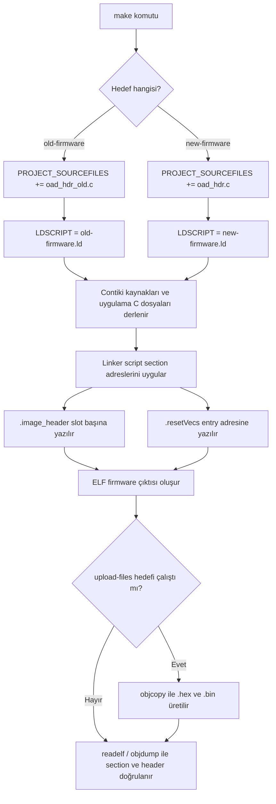

# Build and Verification

Bu dosya derleme komutlarını, `.hex` / `.bin` üretimini ve build sonrası
doğrulama adımlarını toplar.

## Derleme

Contiki-NG `LDSCRIPT` değişkenini global kullandığı için iki imaj ayrı ayrı
derlenmelidir. `Makefile` bu yüzden aynı anda hem `old-firmware` hem de
`new-firmware` hedefinin derlenmesini engeller.

Eski/persistent fallback imaj:

```sh
make TARGET=simplelink BOARD=sensortag/cc1352r1 LDSCRIPT=old-firmware.ld old-firmware
```

Yeni/user update imaj:

```sh
make TARGET=simplelink BOARD=sensortag/cc1352r1 LDSCRIPT=new-firmware.ld new-firmware
```

`CONTIKI ?= ../..` değeri, bu klasörün Contiki-NG kaynak ağacına göre
konumlandırıldığını varsayar. Proje farklı bir yerdeyse derleme sırasında
`CONTIKI=/path/to/contiki-ng` verilebilir.

## Yükleme Dosyalarının Üretimi

Cihaza yazmak için ELF çıktısından `.hex` veya `.bin` dosyası üretilir. Bu
projede bunun için `Makefile` içine `upload-files` hedefi eklendi.

```sh
make TARGET=simplelink BOARD=sensortag/cc1352r1 upload-files
```

Bu komut sırasıyla şunları yapar:

1. `old-firmware` imajını `old-firmware.ld` ile derler.
2. `new-firmware` imajını `new-firmware.ld` ile derler.
3. Her iki ELF çıktısını `arm-none-eabi-objcopy` ile `.hex` ve `.bin` formatına çevirir.
4. Dosyaları `upload/` klasörüne koyar.

Contiki-NG, ELF dosyalarını `build/` altında hedef ve board bilgisine göre iç içe
klasörlere koyabilir. Bu yüzden `Makefile`, ELF yolunu sabit varsaymaz; derleme
sonrası ilgili `old-firmware.simplelink` ve `new-firmware.simplelink` dosyalarını
`find` ile bulur.

`upload/` klasörü build sırasında üretilen demo artifact'leri içindir ve git
tarafında ignore edilir. Teslim/release için `.hex` ve `.bin` dosyaları GitHub
Release eki olarak, yanlarına `sha256sums.txt` eklenerek paylaşılmalıdır.

Temiz üretim:

```sh
rm -rf build upload
make TARGET=simplelink BOARD=sensortag/cc1352r1 upload-files
```

Üretilen firmware dosyaları:

| Dosya | İçerik | Yükleme adresi |
| --- | --- | ---: |
| `upload/old-firmware.hex` | Persistent fallback firmware, OAD header dahil | Adres HEX içinde gömülü |
| `upload/old-firmware.bin` | Persistent fallback raw binary | `0x00030000` |
| `upload/new-firmware.hex` | Yeni user firmware, OAD header dahil | Adres HEX içinde gömülü |
| `upload/new-firmware.bin` | Yeni user firmware raw binary | `0x00000000` |

`arm-none-eabi-objcopy` PATH içinde değilse komut şu şekilde çalıştırılabilir:

```sh
make TARGET=simplelink BOARD=sensortag/cc1352r1 OBJCOPY=/path/to/arm-none-eabi-objcopy upload-files
```

Yükleme için mümkünse `.hex` dosyaları tercih edilmelidir. HEX formatı adres
bilgisini taşıdığı için `old-firmware` ve `new-firmware` doğru flash slotlarına
yerleşir. `.bin` dosyaları raw çıktıdır; programlama aracında başlangıç adresi
elle verilmelidir.

## Docker'dan Dosya Alma

Derleme Docker container içinde yapıldıysa, üretilen `upload/` klasörünü host
makineye almak için `docker cp` komutu container dışında çalıştırılır. Yani
container prompt'u içindeysen önce çık:

```sh
exit
```

Host terminalinde container adını veya ID'sini kullanarak kopyala:

```sh
docker cp interesting_easley:/home/user/contiki-ng/examples/rehydrator/upload ./upload
```

Aynı komut container ID ile de çalışır:

```sh
docker cp 77ccebc3c081:/home/user/contiki-ng/examples/rehydrator/upload ./upload
```

Windows'ta masaüstüne almak için:

```powershell
docker cp interesting_easley:/home/user/contiki-ng/examples/rehydrator/upload "$env:USERPROFILE\Desktop\upload"
```

Tek tek HEX dosyaları alınacaksa:

```sh
docker cp interesting_easley:/home/user/contiki-ng/examples/rehydrator/upload/old-firmware.hex .
docker cp interesting_easley:/home/user/contiki-ng/examples/rehydrator/upload/new-firmware.hex .
```

## Upload Çıktılarının Analizi

Son üretilen `upload/` çıktıları boyut ve adres yerleşimi açısından kontrol
edildi.

| Dosya | Boyut | Görev |
| --- | ---: | --- |
| `upload/old-firmware.bin` | `74324` byte | Eski/persistent fallback imajın raw binary çıktısı |
| `upload/old-firmware.hex` | yaklaşık `204K` | Eski/persistent fallback imajın adres bilgili HEX çıktısı |
| `upload/new-firmware.bin` | `73928` byte | Yeni/user firmware imajının raw binary çıktısı |
| `upload/new-firmware.hex` | yaklaşık `203K` | Yeni/user firmware imajının adres bilgili HEX çıktısı |

OAD header alanları beklenen slotlarla uyumludur:

| İmaj | `imgID` | `imgType` | `prgEntry` | `startAddr` | `softVer` |
| --- | --- | ---: | ---: | ---: | --- |
| `old-firmware` | `CC13x2R1` | `0x00` | `0x00030100` | `0x00030000` | `00000100` |
| `new-firmware` | `CC13x2R1` | `0x07` | `0x00000100` | `0x00000000` | `00000200` |

HEX dosyalarının veri aralıkları:

| İmaj | OAD header aralığı | Firmware body aralığı |
| --- | ---: | ---: |
| `old-firmware.hex` | `0x00030000 - 0x00030037` | `0x00030100 - 0x00042253` |
| `new-firmware.hex` | `0x00000000 - 0x00000037` | `0x00000100 - 0x000120C7` |

Slot kullanım özeti:

| İmaj | Slot aralığı | Kullanılan aralık | Boş kalan alan |
| --- | ---: | ---: | ---: |
| `old-firmware` | `0x00030000 - 0x00051FFF` | `0x00030000 - 0x00042253` | `64940` byte |
| `new-firmware` | `0x00000000 - 0x0002FFFF` | `0x00000000 - 0x000120C7` | `122680` byte |

`readelf -S` ile görülen temel section yerleşimleri:

| Section | `old-firmware` adresi / boyutu | `new-firmware` adresi / boyutu | Beklenen anlam |
| --- | ---: | ---: | --- |
| `.image_header` | `0x00030000` / `0x38` | `0x00000000` / `0x38` | OAD header slot başlangıcında |
| `.resetVecs` | `0x00030100` / `0x40` | `0x00000100` / `0x40` | Reset vector OAD header sonrası entry adresinde |
| `.text` | `0x00030140` / `0x11B60` | `0x00000140` / `0x119D4` | Uygulama kodu reset vector sonrası flash'ta |
| `.ARM.exidx` | `0x00041CA0` / `0x8` | `0x00011B14` / `0x8` | Exception index flash slotu içinde |
| `.data` | `0x20001B20` / `0x4D4` | `0x20001B20` / `0x4D4` | RAM'e kopyalanacak initialized data |
| `.bss` | `0x200020D8` / `0x3234` | `0x200020D8` / `0x3234` | RAM'de sıfırlanacak veri alanı |
| `.stack` | `0x2000530C` / `0x604` | `0x2000530C` / `0x604` | RAM stack alanı |

Kontrol sonucu:

- HEX checksum hatası görülmedi.
- `old-firmware` persistent fallback slotuna sığıyor.
- `new-firmware` page 0 user image slotuna sığıyor.
- Reset handler adresleri kendi slotlarının içinde kalıyor.
- `readelf` çıktısında `.image_header` ve `.resetVecs` adresleri beklenen OAD slotlarıyla uyuşuyor.
- Flash section'ları kendi slot sınırları içinde, RAM section'ları ise `0x20000000` SRAM bölgesinde kalıyor.
- Header sonrası `0x38 - 0xFF` aralığı `0xFF` ile dolu; reset vector tablosu `0x100` offsetinden başlıyor.
- Debug BIM senaryosunda `crc32`, `len`, `imgEndAddr` ve `imgSegLen` alanlarının `0xFFFFFFFF` kalması beklenen durumdur.

## Derleme Akışı



Kısaca:

1. `Makefile`, verilen hedefe bakar.
2. Hedef `old-firmware` ise `oad_hdr_old.c`, hedef `new-firmware` ise `oad_hdr.c` derlemeye eklenir.
3. `LDSCRIPT` ile seçilen linker script flash başlangıç adreslerini belirler.
4. C dosyaları object dosyalarına çevrilir.
5. Link aşamasında `.image_header`, `.resetVecs`, `.text`, `.data`, `.bss`, `.stack` ve DMA alanları doğru adreslere yerleştirilir.
6. Çıkan ELF dosyası `readelf` ve `objdump` ile kontrol edilir.
7. `upload-files` hedefi kullanıldıysa ELF dosyalarından `.hex` ve `.bin` yükleme çıktıları üretilir.
8. Programlama yapılırken sadece ilgili flash slotları yazılır; BIM/CCFG alanı korunur.

## Doğrulama

Section adreslerini kontrol etmek için:

```sh
OLD_ELF=$(find build/simplelink/sensortag/cc1352r1 -type f -name old-firmware.simplelink | head -n 1)
NEW_ELF=$(find build/simplelink/sensortag/cc1352r1 -type f -name new-firmware.simplelink | head -n 1)
arm-none-eabi-readelf -S "$OLD_ELF"
arm-none-eabi-readelf -S "$NEW_ELF"
```

Beklenen:

```text
old-firmware: .image_header 0x00030000, .resetVecs 0x00030100
new-firmware: .image_header 0x00000000, .resetVecs 0x00000100
```

OAD header içeriğini kontrol etmek için:

```sh
arm-none-eabi-objdump -s -j .image_header "$OLD_ELF"
arm-none-eabi-objdump -s -j .image_header "$NEW_ELF"
```

Kontrol edilen temel alanlar:

```text
old-firmware:
  magic     = CC13x2R1
  imgType   = 0x00
  prgEntry  = 0x00030100
  startAddr = 0x00030000

new-firmware:
  magic     = CC13x2R1
  imgType   = 0x07
  prgEntry  = 0x00000100
  startAddr = 0x00000000
```

Yardımcı script aynı section adreslerini otomatik kontrol eder:

```sh
scripts/verify-layout.sh
```
