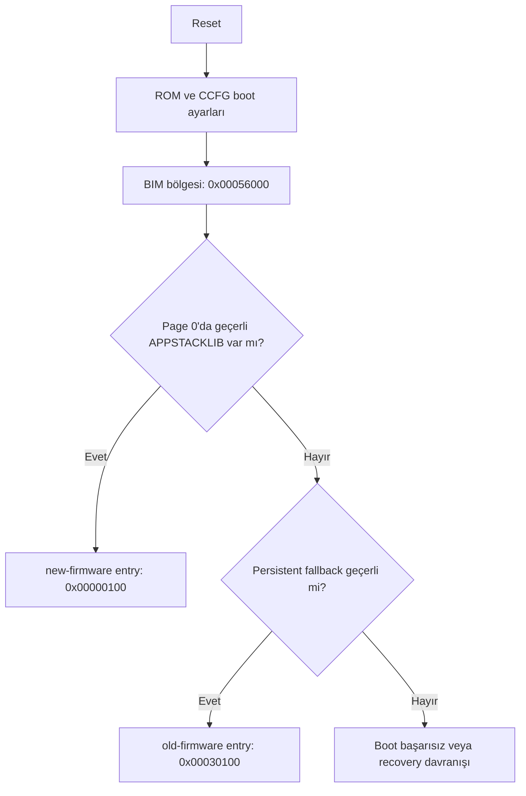

# Flash Layout

Bu dosya CC1352R flash/RAM yerleşimini, BIM'in boot sırasını ve ikinci firmware
stratejisini özetler.

## Temel Bellek Alanları

| Bellek | Adres Aralığı | Kullanım |
| --- | ---: | --- |
| Flash | `0x00000000 - 0x00057FFF` | Uygulama imajları, OAD header, BIM ve CCFG |
| SRAM | `0x20000000 - 0x20013FFF` | Çalışma zamanı veri, stack, bss ve DMA tabloları |
| GPRAM | `0x11000000 - 0x11001FFF` | Cache/GPRAM bölgesi |
| ROM | Cihaz içinde sabit | TI ROM boot kodu ve yardımcı rutinler |

## Firmware Slotları

| Alan | Başlangıç | Bitiş | Görev |
| --- | ---: | ---: | --- |
| User image | `0x00000000` | `0x0002FFFF` | BIM'in ilk aradığı `APPSTACKLIB` imaj |
| Persistent fallback | `0x00030000` | `0x00051FFF` | User imaj yoksa veya geçersizse fallback |
| Metadata | `0x00052000` | `0x00053FFF` | Ayrılmış alan |
| Recovery | `0x00054000` | `0x00055FFF` | Ayrılmış alan |
| BIM + CCFG | `0x00056000` | `0x00057FFF` | Mevcut TI BIM ve CCFG |

Her imaj slotunun ilk `0x100` byte'ı OAD image header için ayrılır. Reset vector
tablosu header alanından sonra başlar.

| İmaj | Header | Entry / Reset Vector | Image Type |
| --- | ---: | ---: | --- |
| `old-firmware` | `0x00030000` | `0x00030100` | `PERSISTENT_APP` |
| `new-firmware` | `0x00000000` | `0x00000100` | `APPSTACKLIB` |

## Boot Akışı

Mevcut BIM şu sırayla imaj arar:



BIM page 0'daki user imajı öncelikli arar. Bu yüzden ilk kurulumda yalnızca
`old-firmware` yüklenirse cihaz eski firmware ile açılır; daha sonra
`new-firmware` page 0'a yazıldığında BIM yeni imajı seçer.

Beklenen davranış:

- İlk kurulumda `old-firmware` çalışıyorsa yeşil LED heartbeat verir.
- Güncellemeden sonra `new-firmware` çalışıyorsa kırmızı LED heartbeat verir.

## CCFG Notu

CCFG, reset sonrası cihaz davranışını ve boot zincirini etkileyen kritik flash
alanıdır. Bu projede BIM + CCFG bölgesi son sektörde tutulur:

```text
0x00056000 - 0x00057FFF
```

Bu bölge yanlışlıkla silinirse cihaz beklenen BIM akışına giremeyebilir. Bu
yüzden yükleme yaparken full chip erase yerine bölge bazlı programlama
kullanılmalıdır.

## İkinci Firmware Stratejisi

Mevcut BIM değiştirilmediği için eski ve yeni firmware iki ayrı slotta tutulur.
İlk yüklenecek eski imaj olan `old-firmware`, `0x00030000 - 0x00051FFF`
aralığındaki persistent fallback slotuna yazılır. Bu sayede page 0 henüz boşken
cihaz eski firmware ile açılabilir.

Güncelleme aşamasında `new-firmware`, page 0'daki `0x00000000 - 0x0002FFFF`
user image slotuna yazılır. BIM reset sonrası önce page 0'ı kontrol ettiği için
yeni imaj geçerliyse artık `new-firmware` çalışır; `old-firmware` ise fallback
olarak flash'ta kalır.

Tam firmware değiştirme veya staging alanındaki imajı aktif alana kopyalama gibi
işlemler için ek bootloader/recovery mantığı gerekir. Bu çalışmada yeni bootloader
yazılmamış, mevcut TI BIM/OAD modeli kullanılmıştır.

## Sorular ve Cevaplar

| Soru | Cevap |
| --- | --- |
| Uygulamanın ilk çalışan eski imajı nereye yerleşecek? | İlk yüklenecek `old-firmware`, persistent fallback slotu olan `0x00030000 - 0x00051FFF` aralığına yerleşir. Entry adresi `0x00030100` olur. |
| Güncelleme olarak yüklenecek yeni imaj hangi alana yazılacak? | `new-firmware`, BIM'in öncelikli baktığı page 0 user image slotuna yazılır: `0x00000000 - 0x0002FFFF`. Entry adresi `0x00000100` olur. |
| Aynı anda iki tam imaj saklanabiliyor mu? | Bu örnek imajlar küçük olduğu için evet. TI on-chip OAD dokümanı ise bunun flash yerleşimine ve user uygulamanın yeterince küçük olmasına bağlı olduğunu belirtir. |
| Sadece staging alanı varsa aktivasyon nasıl yapılır? | Staging imajı doğrudan seçilmeyecekse BIM/bootloader/recovery kodu tarafından doğrulanıp aktif alana kopyalanmalı veya OAD header üzerinden seçilebilir hale getirilmelidir. Bu projede mevcut BIM'e uyumlu iki seçilebilir slot kullanıldı. |
| Flash erase/write işlemleri mevcut çalışan imajı nasıl etkiler? | Flash silme işlemi sektör bazlıdır. Çalışan imajın veya BIM/CCFG alanının bulunduğu sektör silinirse cihaz boot edemeyebilir. Bu yüzden full chip erase yerine bölge bazlı programlama kullanılır. |
