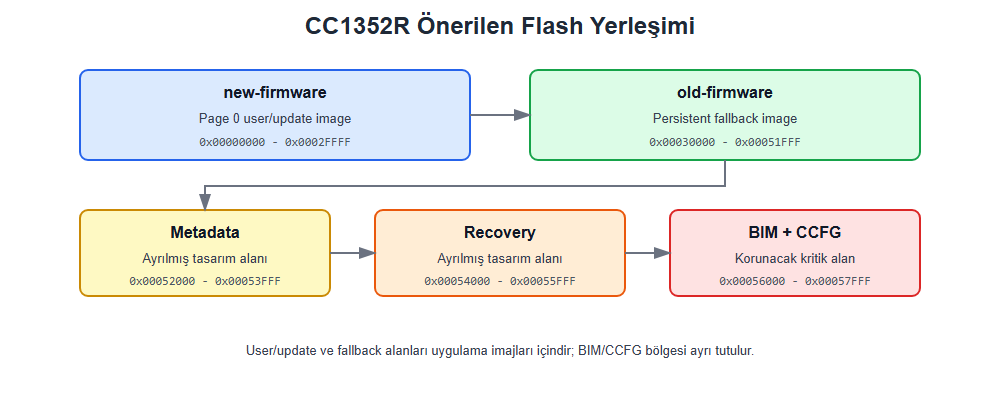
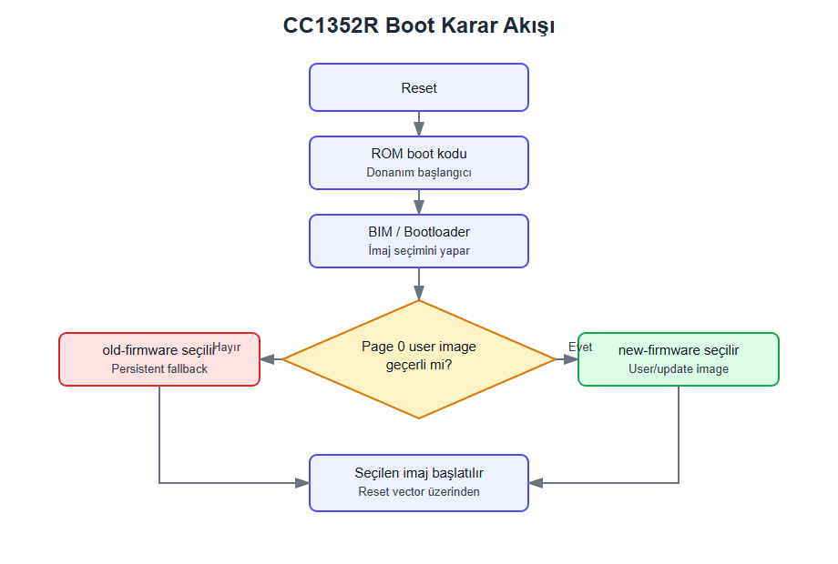
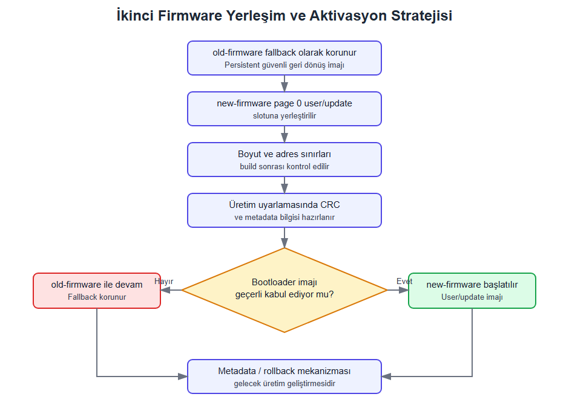

# Özet

Bu çalışma kapsamında, Texas Instruments CC1352R platformunda iki firmware imajının aynı flash bellek üzerinde güvenli biçimde konumlandırılması ve reset sonrasında hangi imajın çalıştırılacağını belirleyen boot süreci incelenmiştir. Çalışma, ağ üzerinden OTA paket aktarımı tasarlamaya değil, üçüncü iş parçacığı olan gerçek donanım yerleşimi ve boot uyarlamasına odaklanmaktadır. Bu kapsamda `old-firmware` persistent fallback imajı, `new-firmware` ise BIM tarafından öncelikli değerlendirilen user image olarak ele alınmıştır.

Derleme sonucunda elde edilen ELF, section, sembol ve boyut çıktıları doğrulanabilirlik amacıyla `docs/report/outputs/` altında korunmuştur. Ana raporda bu ham çıktıların doğrudan dökümü yerine, bunlardan üretilen karşılaştırmalı tablolar ve kısa teknik yorumlar kullanılmıştır. Sonuç olarak, yeni firmware imajının yalnızca flash belleğe yazılması yeterli kabul edilemez; geçerli OAD image header, doğru reset vector yerleşimi, slot sınırı kontrolü, BIM davranışı ve CCFG koruması birlikte değerlendirilmelidir.

**Anahtar Kelimeler:** CC1352R, firmware güncelleme, BIM, OAD, CCFG, flash yerleşimi, ELF analizi, Contiki-NG, ARM Cortex-M.

**Teknik Etiketler:** Firmware Update | OAD | BIM | CCFG | ARM Cortex-M

# Giriş

Gömülü sistemlerde firmware güncelleme işlemi, yalnızca yeni uygulama kodunun derlenmesi veya cihaza yazılması değildir. Mikrodenetleyici reset aldığında çalışmanın hangi adresten başlayacağı, uygulama imajının hangi başlık bilgilerini taşıdığı ve boot yöneticisinin bu imajı geçerli kabul edip etmediği sistemin güvenilirliğini doğrudan belirler. CC1352R gibi kaynak kısıtlı mikrodenetleyicilerde flash bellek aynı anda uygulama imajlarını, boot yöneticisini ve cihaz konfigürasyon alanını barındırdığı için bellek yerleşimi tasarımın merkezindedir [@ti_cc1352r_datasheet; @ti_cc13x2_trm].

Bu çalışma, BİL 304 dönem çalışmasının üçüncü iş parçacığı için hazırlanmıştır. Proje genel olarak firmware güncelleme bağlamından doğmuş olsa da bu raporun ana konusu Cooja simülasyonu, ACK/NACK mekanizması veya ağ üzerinden veri aktarımı değildir. Burada incelenen problem, Contiki-NG ile derlenen iki uygulama imajının CC1352R üzerinde mevcut TI BIM/OAD boot modeline uygun biçimde yerleştirilmesidir [@contiking; @contiki_simplelink; @ti_bim].

# Yöntem ve Kapsam

Çalışmada yeni bir bootloader yazılmamış ve TI BIM kaynak kodu değiştirilmemiştir. Bunun yerine firmware tarafındaki linker script, OAD image header ve flash slot adresleri mevcut BIM'in beklediği yapıya göre düzenlenmiştir. `old-firmware`, persistent fallback imajı olarak `0x00030000` başlangıç adresine; `new-firmware`, user image olarak `0x00000000` başlangıç adresine yerleştirilmiştir.

> **Kapsam Notu:** Bu rapor yalnızca BİL 304 dönem çalışmasının 3. iş parçacığı olan CC1352R gerçekleme ve donanım uyarlama görevini kapsamaktadır. Cooja tabanlı OTA paket aktarımı ve MSP430 ELF analizi bu raporun ana konusu değildir.

Bu çalışma kapsamında üç temel soruya cevap aranmıştır. Birincisi, firmware imajlarının kod, veri ve RAM bölümleri bakımından ne kadar yer kapladığıdır. İkincisi, bu imajların CC1352R flash haritasında hangi slotlara yerleştiğidir. Üçüncüsü, reset sonrasında hangi imajın çalıştırılacağına uygulama kodunun değil, BIM ve boot zincirinin nasıl karar verdiğidir.

# Uygulama Mimarisi

**Bu bölümdeki odak:** Firmware imajlarını üreten kaynak dosyalarını, linker betiklerini ve OAD header bileşenlerini tek bir mimari çerçevede değerlendirmek.

**Temel bulgu:** Proje, BIM kaynak kodunu değiştirmeden iki farklı boot rolüne sahip imaj üretmektedir: page 0 user image ve persistent fallback.

Projede iki uygulama kaynak dosyası, iki OAD header kaynağı ve iki linker script birlikte kullanılır. Bu ayrım, aynı kod tabanından farklı boot rollerine sahip iki ayrı firmware imajı üretmeyi sağlar [@rehydrator_repo].

**Tablo 1. Proje dosyaları ve görevleri**

| Dosya | Görevi |
|---|---|
| `old-firmware.c` | Persistent fallback uygulamasıdır; seri log üzerinden eski imajın çalıştığını gösterir. |
| `new-firmware.c` | User/update uygulamasıdır; BIM'in yeni imaja geçtiğini seri log üzerinden gösterir. |
| `oad_layout.h` | Flash slot adreslerini, slot boyutlarını, entry adreslerini ve sürümleri tanımlar. |
| `oad_hdr_old.c` | `old-firmware` için `PERSISTENT_APP` tipinde OAD image header üretir. |
| `oad_hdr.c` | `new-firmware` için `APPSTACKLIB` tipinde OAD image header üretir. |
| `old-firmware.ld` | Eski imajın header ve reset vector adreslerini persistent fallback slotuna taşır. |
| `new-firmware.ld` | Yeni imajın header ve reset vector adreslerini page 0 user slotuna taşır. |
| `Makefile` | İmajları ayrı derler, doğru header dosyasını seçer ve HEX/BIN çıktıları üretir. |

Derleme çıktıları `build/simplelink/sensortag/cc1352r1/` altında, cihaza yazılacak HEX/BIN dosyaları ise `upload/` altında oluşur. Rapor kanıtı olarak kullanılan terminal çıktıları doğrulanabilirlik amacıyla `docs/report/outputs/` klasöründe korunmuştur.

# Deneysel ve Derleme Bulguları

**Bu bölümdeki odak:** Derleme çıktılarından elde edilen `.text`, `.data` ve `.bss` değerlerini yorumlayarak firmware imajlarının flash ve RAM etkisini değerlendirmek.

**Temel bulgu:** Her iki imaj da ayrılan slotlara sığmaktadır; `.bss` değeri flash dosya boyutuna değil çalışma zamanı RAM yüküne katkı yapmaktadır.

Bu bölümde `old-firmware` ve `new-firmware` imajlarının derleme sonrası bellek kullanımları incelenmiştir. Bu analiz, iki firmware imajının flash ve RAM üzerindeki etkisini sayısal olarak değerlendirmek ve ikinci firmware imajının CC1352R flash belleğinde hangi koşullarda konumlandırılabileceğini belirlemek üzere gerçekleştirilmiştir. Analizde derleme çıktılarından elde edilen `.text`, `.data` ve `.bss` değerleri kullanılmıştır.

**Tablo 2. `old-firmware` ve `new-firmware` bellek kullanım karşılaştırması**

| Firmware İmajı | `.text` | `.data` | `.bss` | Toplam | Teknik Anlamı |
|---|---:|---:|---:|---:|---|
| `old-firmware` | 72672 byte | 1452 byte | 14520 byte | 88644 byte | Persistent fallback olarak korunan güvenli geri dönüş imajı |
| `new-firmware` | 72276 byte | 1452 byte | 14520 byte | 88248 byte | Page 0 user/update image alanına yerleştirilen yeni uygulama imajı |

`.text` alanı çalıştırılabilir makine kodunu ve genellikle flash bellekte yer alan program bölümünü temsil eder. `.data` bölümü başlangıç değeri olan global veya statik değişkenleri ifade eder; bu bölümün ilk değerleri flash üzerinde tutulur, çalışma sırasında RAM'e kopyalanır. `.bss` bölümü ise başlangıçta sıfırlanan değişkenlerden oluşur ve doğrudan RAM kullanımını etkiler. Bu nedenle firmware imajının yalnızca dosya boyutuna bakmak yeterli değildir; kodun flash üzerindeki kapladığı alan ile çalışma zamanında RAM üzerinde oluşturduğu yük ayrı ayrı değerlendirilmelidir.

# Bellek Yerleşimi ve Boot Analizi

**Bu bölümdeki odak:** İki firmware imajının dahili flash üzerinde çakışmadan konumlandırılıp konumlandırılamayacağını değerlendirmek.

**Temel bulgu:** `new-firmware` page 0 user image slotuna, `old-firmware` persistent fallback slotuna sığmaktadır; BIM/CCFG bölgesi uygulama imajlarından ayrı tutulmuştur.

Bu bölümde CC1352R platformu için önerilen flash bellek yerleşimi incelenmiştir. Bu yerleşim, persistent fallback olarak tutulan `old-firmware` imajını korurken `new-firmware` imajını page 0 user/update image alanında konumlandırmak üzere tasarlanmıştır. Bu yaklaşımda yeni firmware'in doğrudan fallback alanının üzerine yazılmaması tercih edilmiştir. Bunun yerine imaj, BIM tarafından öncelikli değerlendirilen ayrı bir user image alanında tutulur; metadata ve recovery bölgeleri ise üretim seviyesinde doğrulama, sağlık kontrolü ve geri dönüş mekanizmaları için ayrılmış tasarım alanları olarak değerlendirilir.

**Tablo 3. CC1352R flash yerleşim özeti**

| Bölge | Başlangıç | Bitiş | Boyut | Rol |
|---|---:|---:|---:|---|
| User image | `0x00000000` | `0x0002FFFF` | `0x00030000` | `new-firmware` |
| Persistent fallback | `0x00030000` | `0x00051FFF` | `0x00022000` | `old-firmware` |
| Metadata | `0x00052000` | `0x00053FFF` | `0x00002000` | Ayrılmış doğrulama alanı |
| Recovery | `0x00054000` | `0x00055FFF` | `0x00002000` | Ayrılmış kurtarma alanı |
| BIM + CCFG | `0x00056000` | `0x00057FFF` | `0x00002000` | Kritik boot alanı |

Tablo 3'te özetlenen yerleşim stratejisinde flash bellek, user image, persistent fallback, metadata, recovery ve BIM/CCFG bölgeleri olarak mantıksal parçalara ayrılmıştır.

- User image alanı, güncelleme sonrası çalıştırılması hedeflenen `new-firmware` için ayrılmıştır.
- Persistent fallback alanı, user image yoksa veya geçersizse çalıştırılacak `old-firmware` için korunmuştur.
- Metadata ve recovery alanları bu çalışmada ayrılmış, fakat otomatik metadata yazma veya rollback mekanizması olarak gerçeklenmemiştir.
- BIM + CCFG alanı boot zinciri için kritik kabul edilmiş ve uygulama imajlarından ayrı tutulmuştur.

Bu çalışmada metadata ve recovery alanları flash yerleşiminde ayrılmıştır. Ancak üretim seviyesinde metadata yazma, sağlık kontrolü ve otomatik rollback mekanizmaları ayrıca geliştirilmelidir. CCFG alanı ise cihazın düşük seviye konfigürasyon bilgilerini içerdiği için normal uygulama veya user/update verisi gibi kullanılmamalıdır.

{width=85%}

Bu bellek haritası, ikinci firmware imajının fallback uygulama alanından ayrı tutulduğunu göstermektedir. Bu ayrım, güvenli güncelleme tasarımı açısından önemlidir. Çünkü çalışan veya kurtarma için saklanan firmware'in üzerine doğrudan yazılması, işlem yarıda kesildiğinde cihazın açılmamasına neden olabilir. Ayrı user/update alanı kullanmak ise yeni imaj doğrulanana kadar fallback sisteminin korunmasını sağlar.

**Tablo 4. Derleme çıktısına göre old/new firmware flash planı**

| Firmware İmajı | Slot Aralığı | Kullanılan Aralık | Raw BIN Boyutu | Boş Kalan Alan |
|---|---:|---:|---:|---:|
| `old-firmware` | `0x00030000 - 0x00051FFF` | `0x00030000 - 0x00042253` | 74324 byte | 64940 byte |
| `new-firmware` | `0x00000000 - 0x0002FFFF` | `0x00000000 - 0x000120C7` | 73928 byte | 122680 byte |

Tablo 2 ve Tablo 4 farklı ölçümleri göstermektedir. Tablo 2'deki "Toplam" değeri `arm-none-eabi-size` çıktısındaki `.text + .data + .bss` toplamıdır; yani flash yükü ile çalışma zamanı RAM yükünü birlikte ifade eder. Tablo 4'teki Raw BIN boyutu ise cihaza yazılacak ikili imajın flash üzerinde kapladığı alanı gösterir. `.bss` bölümü flash dosyasında fiziksel veri olarak yer almadığı için Raw BIN boyutu, Tablo 2'deki toplam değerden daha küçüktür.

RAM tarafında `old-firmware` ve `new-firmware` aynı uygulama düzenini kullanmaktadır. `.data`, `.bss`, `vtable_ram` ve `.stack` section'ları `0x20000000` tabanlı SRAM bölgesinde yer alır. Bu durum flash slotlarının farklı olmasına rağmen çalışan uygulamanın RAM modelinin aynı kaldığını gösterir.

# Boot Zinciri ve BIM Davranışı

**Bu bölümdeki odak:** Reset sonrasında hangi imajın çalıştırılacağına neden uygulama kodunun değil boot zincirinin karar verdiğini açıklamak.

**Temel bulgu:** Flash üzerinde yeni imaj bulunması yeterli değildir; BIM veya benzeri bir bootloader imaj başlığını, reset vector yerleşimini ve bütünlük bilgisini değerlendirmelidir.

CC1352R platformunda firmware güncelleme sürecinde yeni imajın yalnızca flash belleğe yazılması yeterli kabul edilemez. Bir firmware imajının çalıştırılabilmesi için reset sonrasında işlemcinin doğru başlangıç adresine yönlendirilmesi, imajın geçerli olduğunun anlaşılması ve hatalı imaj durumunda güvenli geri dönüş yolunun bulunması gerekir. Bu nedenle ikinci firmware imajının flash bellekte veri veya aday imaj olarak tutulması ile bu imajın boot edilebilir hale gelmesi farklı konulardır.

Bu çalışmada `old-firmware`, cihaz üzerinde persistent fallback olarak saklanan güvenli geri dönüş imajı şeklinde değerlendirilmiştir. `new-firmware` ise fallback alanının üzerine yazılmamış, page 0 user/update image alanında saklanan aday imaj olarak ele alınmıştır. Bu yaklaşımda yeni imajın çalıştırılması için reset sonrasında bir boot karar mekanizmasının devreye girmesi gerekir. CC1352R tarafında bu rol, BIM veya benzeri bir bootloader yapısı ile ilişkilendirilebilir [@ti_bim; @ti_oad_overview].

{width=70%}

Yukarıdaki boot karar akışı, önerilen reset sonrası seçim sürecini göstermektedir. Reset sonrasında ilk kontrol uygulama seviyesinde değil, boot aşamasında gerçekleşmelidir. Bu nedenle `new-firmware` dosyasının flash bellekte bulunması tek başına yeterli değildir. Boot mekanizması bu imajın başlangıç adresini, boyutunu, sürümünü ve bütünlük bilgisini kontrol edebilmelidir. Yeni imajın geçersiz veya bütünlüğü bozulmuş olması durumunda sistemin `old-firmware` ile devam etmesi gerekir. Bu davranış, hatalı firmware nedeniyle cihazın tamamen kullanılamaz hale gelmesini önler.

**Tablo 5. Boot aşamaları**

| Boot Aşaması | Görevi | Bu Projedeki Karşılığı |
|---|---|---|
| Reset | Cihazın başlangıç sürecini başlatır | Güç verilmesi veya yazılımsal reset sonrası ilk aşama |
| ROM boot kodu | Donanımın temel başlangıç sürecini yürütür | Cihazın düşük seviye boot davranışı |
| BIM / Bootloader | Hangi imajın çalıştırılacağına karar verir | `old-firmware` veya `new-firmware` seçimi |
| Metadata kontrolü | Aday imajın geçerliliğini denetler | Bu çalışmada tasarım önerisi; otomatik metadata yazma yoktur |
| Fallback | Hatalı imaj durumunda güvenli geri dönüş sağlar | `old-firmware` ile çalışmaya devam etme |

Bu yapıdaki en kritik nokta, boot kararının uygulama çalıştıktan sonra değil, uygulama başlamadan önce verilmesidir. Çalışan bir firmware'in kendi üzerine yazılması riskli bir işlemdir; işlem yarıda kesilirse cihazın açılmama ihtimali oluşur. Bu nedenle güvenli firmware güncelleme tasarımında yeni imaj page 0 user/update image alanına yerleştirilmeli, ardından bütünlük kontrolünden geçirilmeli ve en son boot mekanizması tarafından aktif hale getirilmelidir.

Bu çalışmada tam anlamıyla üretim seviyesinde bir firmware değiştirme sistemi gerçeklenmemiştir. Bunun yerine, CC1352R üzerinde ikinci firmware imajının nasıl konumlandırılabileceği, bu imajın boot süreciyle nasıl ilişkilendirilebileceği ve neden BIM/bootloader desteğine ihtiyaç duyulduğu analiz edilmiştir. Bu projede `new-firmware` için OAD image header `0x00000000` adresine, reset vector ise `0x00000100` adresine yerleştirilmiştir. `old-firmware` için karşılık gelen adresler `0x00030000` ve `0x00030100` değerleridir. Bu ayrım, BIM'in page 0 user image ve persistent fallback imajını farklı rollerle değerlendirebilmesini sağlar.

# CCFG ve Güvenlik Değerlendirmesi

**Bu bölümdeki odak:** CCFG alanının neden normal uygulama veya veri alanı gibi kullanılamayacağını ortaya koymak.

**Temel bulgu:** CCFG'nin bozulması yalnızca uygulama hatası değil, cihazın reset sonrası başlangıç davranışını etkileyen kritik bir sistem riski oluşturur.

CCFG, CC1352R platformunda cihazın düşük seviye konfigürasyon bilgilerinin tutulduğu kritik flash bölgelerinden biridir. Bu alan normal uygulama verisi gibi değerlendirilmemelidir. Çünkü CCFG bölgesi; boot davranışı, cihaz başlangıç ayarları, debug erişimi, flash koruma ayarları ve bazı donanımsal yapılandırmalar üzerinde etkili olabilir. Bu nedenle firmware güncelleme veya UniFlash ile yükleme işlemleri sırasında CCFG alanının yanlışlıkla silinmesi, cihazın beklenen şekilde başlamamasına veya programlama/debug sürecinde erişim problemleri oluşmasına yol açabilir [@ti_rom_bootloader_ccfg; @ti_uniflash].

Bu çalışmada CCFG alanı, `old-firmware` veya `new-firmware` için kullanılacak sıradan bir saklama alanı olarak ele alınmamıştır. Aksine, korunması gereken özel bir konfigürasyon bölgesi olarak değerlendirilmiştir. Flash yerleşiminde yeni firmware imajı, metadata alanı veya recovery alanı planlanırken bu bölgelerin CCFG ile çakışmaması temel bir tasarım koşulu olarak kabul edilmiştir.

CCFG alanının kritik olmasının temel nedeni, boot zincirinin yalnızca uygulama kodundan ibaret olmamasıdır. Reset sonrasında cihazın nasıl davranacağı; ROM boot kodu, BIM/bootloader yapısı, uygulama imajı ve cihaz konfigürasyon alanlarıyla birlikte belirlenir. Dolayısıyla CCFG alanında oluşacak bir bozulma, yalnızca uygulama seviyesinde bir hata oluşturmaz; cihazın başlangıç akışını doğrudan etkileyebilir.

Bu nedenle firmware güncelleme tasarımında üç temel güvenlik ilkesi izlenmelidir:

1. CCFG alanı uygulama veya user/update verisi için kullanılmamalıdır.
2. Flash erase/write işlemleri sayfa sınırları dikkate alınarak yapılmalıdır.
3. UniFlash ile yükleme yapılırken CCFG bölgesinin yanlışlıkla silinmediği kontrol edilmelidir.

Özellikle ikinci firmware imajının flash üzerinde ayrı bir page 0 user image alanında saklandığı bu çalışmada, CCFG alanının korunması güvenli boot davranışı açısından zorunludur. Yeni imajın geçersiz olması durumunda sistemin `old-firmware` ile çalışmaya devam edebilmesi, yalnızca uygulama kodunun sağlam kalmasına değil, aynı zamanda boot zincirinde kullanılan konfigürasyon alanlarının da korunmasına bağlıdır.

**Tablo 6. CCFG riskleri**

| Risk | Olası Sonuç | Alınması Gereken Önlem |
|---|---|---|
| CCFG alanının yanlışlıkla silinmesi | Cihazın beklenen şekilde başlamaması | Flash yerleşiminde CCFG ayrı ve korumalı bölge olarak tanımlanmalıdır |
| Yeni firmware'in CCFG ile çakışması | Boot veya debug davranışında bozulma | Linker ve layout dosyalarında adres sınırları kontrol edilmelidir |
| Tüm flash'ın bilinçsizce silinmesi | BIM, CCFG veya çalışan imajın kaybı | UniFlash işlemlerinde seçili erase yöntemi dikkatle kullanılmalıdır |
| Metadata/recovery alanının CCFG'ye taşması | Boot karar bilgilerinde veya cihaz ayarlarında hata | Boyut kontrolleri build sonrası doğrulama betikleriyle yapılmalıdır |

Sonuç olarak CCFG alanı, firmware güncelleme sürecinde sıradan bir veri saklama alanı olarak değerlendirilemez. Bu alanın korunması, hem cihazın yeniden başlatılabilirliği hem de debug/programlama erişiminin sürdürülebilirliği açısından önemlidir. Bu nedenle önerilen bellek yerleşiminde CCFG bölgesi en sonda ayrı bir kritik alan olarak bırakılmış ve ikinci firmware imajı için kullanılmamıştır.

# On-Chip Bootloader Alternatifleri ve Aktivasyon Stratejisi

**Bu bölümdeki odak:** İkinci firmware imajının flash üzerinde nasıl aday imaj olarak tutulacağını ve hangi koşullarda aktif hale getirilebileceğini açıklamak.

**Temel bulgu:** Güvenli aktivasyon için page 0 user/update alanı, metadata doğrulaması, image header ve BIM kararı birlikte düşünülmelidir.

Bu çalışmada ikinci firmware imajı, persistent fallback alanının üzerine yazılacak bir imaj olarak değil, page 0 user/update image alanında tutulacak boot edilebilir aday imaj olarak değerlendirilmiştir. Bunun temel nedeni, fallback firmware'in üzerine doğrudan yazma işleminin güvenli olmamasıdır. Flash silme veya yazma işlemi sırasında güç kesintisi, hatalı imaj, adres çakışması veya eksik veri gibi bir durum oluşursa cihazın güvenli geri dönüş yolu da bozulabilir. Bu nedenle yeni firmware ayrı bir user/update slotuna yerleştirilmeli, ardından doğrulanmalı ve ancak bundan sonra boot sürecinde aktif hale getirilmelidir.

Önerilen yapıda `old-firmware`, persistent fallback olarak korunan güvenli geri dönüş imajıdır. `new-firmware` ise page 0 user/update image alanına yerleştirilen yeni uygulama imajıdır. Bu aday imajın güvenli biçimde çalıştırılabilmesi için bootloader/BIM tarafının imaj başlığını, reset vector yerleşimini ve bütünlük bilgisini tanıyabilmesi gerekir. Metadata alanında yeni imajın sürüm bilgisi, imaj boyutu, başlangıç adresi, CRC değeri ve geçerlilik durumu tutulabilir; ancak bu çalışmada otomatik metadata yazma ve rollback mekanizması gerçeklenmemiştir.

Derleme çıktılarından elde edilen boyutlara göre bu projedeki iki firmware imajı aynı anda flash üzerinde saklanabilmektedir. `new-firmware` için ayrılan `0x00000000 - 0x0002FFFF` aralığında 73928 byte'lık imajdan sonra 122680 byte boş alan kalmaktadır. `old-firmware` için ayrılan `0x00030000 - 0x00051FFF` aralığında ise 74324 byte'lık imajdan sonra 64940 byte boş alan kalmaktadır. Bu nedenle şartnamede belirtilen cihaz diskine/data alanına kaydetme fikri, bu çalışma kapsamında flash üzerinde ayrılmış page 0 user/update image alanına yeni imajın yerleştirilmesi şeklinde yorumlanmıştır.

| Bileşen | Görevi | Bu Projedeki Kullanımı |
|---|---|---|
| `old-firmware` | Persistent fallback firmware | `0x00030000` tabanlı fallback alanında güvenli geri dönüş imajı olarak korunur |
| `new-firmware` | Page 0 user/update firmware | `0x00000000` tabanlı user image alanında BIM'in öncelikli aday imajı olarak yer alır |
| Metadata | İmaj hakkında doğrulama bilgisi tutabilir | Bu çalışmada alan ayrılmıştır; otomatik metadata yazma gerçeklenmemiştir |
| BIM / Bootloader | Boot sırasında imaj seçimi yapar | Geçerli yeni imaj varsa onu, yoksa persistent fallback imajını seçmelidir |
| CCFG | Cihaz konfigürasyon bilgilerini tutar | Korunması gereken kritik alan olarak değerlendirilir |

Üretim seviyesinde tamamlanmış bir sistem için önerilen aktivasyon süreci şu adımlardan oluşmaktadır:

1. Cihaza `old-firmware` persistent fallback imajı olarak yüklenir.
2. `new-firmware` imajı page 0 user/update image alanına yerleştirilir.
3. Yeni imajın boyutu ve başlangıç adresi kontrol edilir.
4. Üretim uyarlamasında yeni imaj için CRC veya benzeri bütünlük kontrolü hesaplanır.
5. Üretim uyarlamasında metadata alanına yeni imajın geçerlilik bilgisi yazılmalıdır.
6. Cihaz resetlenir.
7. Reset sonrası BIM/bootloader imaj başlığını ve varsa metadata alanını kontrol eder.
8. Yeni imaj geçerliyse `new-firmware` seçilir.
9. Yeni imaj geçersizse sistem `old-firmware` ile çalışmaya devam eder.

{width=75%}

Yukarıdaki aktivasyon akışı, ikinci firmware imajının fallback alanının üzerine yazılmadığını; page 0 user/update image alanına yerleştirildiğini, ardından doğrulama ve üretim seviyesinde metadata güncellemesiyle boot sürecine aday hale getirilebileceğini göstermektedir. Bu yaklaşım, geçersiz veya bütünlüğü bozulmuş bir firmware imajının cihazı kullanılamaz hale getirmesini önlemek için tercih edilmiştir.

Bu tasarımda en önemli nokta, `new-firmware` imajının flash bellekte bulunmasının tek başına yeterli olmamasıdır. Bir imajın boot edilebilir hale gelmesi için başlangıç adresinin, vektör tablosunun, imaj başlığının ve bütünlük bilgisinin boot mekanizması tarafından tanınabilir olması gerekir. Bu nedenle ikinci firmware imajı, yalnızca uygulama koduyla aktif hale getirilemez. Uygulama kodu çalışırken yeni imajı bir bölgeye yazabilir; fakat reset sonrasında hangi imajın çalıştırılacağına karar verme görevi bootloader/BIM tarafındadır.

Bu yaklaşım aynı zamanda fallback imkânı sağlar. Yeni firmware'in eksik, geçersiz veya uyumsuz olması durumunda sistemin mevcut `old-firmware` ile çalışmaya devam etmesi mümkündür. Bu nedenle güvenli firmware güncelleme tasarımında page 0 user/update alanı, metadata kontrolü ve bootloader kararı birlikte düşünülmelidir.

# Bulgular ve Tartışma

Bu bölüm, önceki teknik analizlerden çıkan tasarım kararlarını kısa mühendislik kayıtları halinde özetlemektedir. Bu değerlendirme, çalışmanın yalnızca adres ve çıktı listesinden ibaret kalmamasını; hangi kararın neden verildiğini ve hangi sonuçları doğurduğunu açık biçimde ortaya koymak üzere eklenmiştir.

### Tasarım Kararı 1 — İki Slotlu Flash Yerleşimi

**Karar:** `new-firmware`, page 0 user image alanına; `old-firmware`, persistent fallback alanına yerleştirilmiştir.

**Gerekçe:** Yeni imajın geçersiz veya bütünlüğü bozulmuş olması durumunda cihazın tamamen açılmaz hale gelmemesi için fallback imajının korunması gerekir.

**Sonuç:** Derleme çıktıları, iki imajın aynı anda flash üzerinde saklanabildiğini göstermektedir. `new-firmware` kendi slotunda 122680 byte, `old-firmware` ise kendi slotunda 64940 byte boş alan bırakmaktadır.

### Tasarım Kararı 2 — OAD Header ve Reset Vector Ayrımı

**Karar:** Her imajın ilk `0x100` byte'ı OAD image header için ayrılmış, reset vector tablosu bu alanın sonrasına yerleştirilmiştir.

**Gerekçe:** BIM'in imajı tanıyabilmesi için metadata ve uygulama başlangıç vektörleri beklenen adreslerde bulunmalıdır.

**Sonuç:** `old-firmware` için `.image_header = 0x00030000` ve `.resetVecs = 0x00030100`; `new-firmware` için `.image_header = 0x00000000` ve `.resetVecs = 0x00000100` doğrulanmıştır.

### Tasarım Kararı 3 — CCFG Alanının Uygulama İmajlarından Ayrılması

**Karar:** CCFG alanı normal uygulama veya update verisi için kullanılmamıştır.

**Gerekçe:** CCFG bozulursa sorun yalnızca uygulama düzeyinde kalmaz; cihazın reset sonrası başlangıç davranışı ve debug/programlama erişimi etkilenebilir.

**Sonuç:** BIM + CCFG bölgesi `0x00056000 - 0x00057FFF` aralığında kritik alan olarak bırakılmıştır.

# Sınırlılıklar

**Bu bölümdeki odak:** Tasarımın hangi yönlerinin üretim seviyesinde tamamlanmadığını ve hangi risklerin kaldığını açıkça belirtmek.

**Temel bulgu:** Bu çalışma bellek yerleşimi ve boot uyarlamasını göstermektedir; kriptografik imzalama, otomatik rollback ve tam metadata yönetimi ileriki aşamalarda ele alınmalıdır.

Bu çalışma, CC1352R platformunda ikinci bir firmware imajının flash bellekte nasıl konumlandırılabileceğini ve bu imajın boot süreciyle nasıl ilişkilendirilebileceğini incelemektedir. Ancak çalışma, üretim seviyesinde tam güvenli bir OTA firmware güncelleme sistemi olarak değerlendirilmemelidir. Bunun temel nedeni, gerçek bir firmware değişim sürecinin yalnızca yeni imajı belleğe yazmakla tamamlanmamasıdır. Yeni imajın geçerli olduğunun doğrulanması, boot zinciri tarafından tanınması, hatalı güncelleme durumunda eski imaja geri dönülebilmesi ve kritik bellek bölgelerinin korunması gerekir [@ti_bim; @ti_oad_overview].

Bu kapsamda çalışmanın başlıca riskleri ve sınırlılıkları aşağıda verilmiştir.

**Tablo 7. Riskler ve sınırlılıklar**

| Risk / Sınırlılık | Açıklama | Etkisi |
|---|---|---|
| Bootloader/BIM entegrasyonunun sınırlı olması | Yeni firmware flash üzerinde saklansa bile boot mekanizması tarafından seçilmezse çalıştırılamaz | Yeni imajın otomatik başlaması mümkün olmaz |
| Flash alanının sınırlı olması | Aynı anda iki tam firmware imajı saklamak her zaman mümkün olmayabilir | İkinci imaj alanı dikkatle planlanmalıdır |
| CCFG alanının bozulma riski | Yanlış flash silme/yazma işlemi CCFG bölgesini etkileyebilir | Cihazın boot veya debug davranışı bozulabilir |
| Çalışan imajın üzerine yazma riski | Aktif firmware alanı yanlışlıkla silinirse cihaz açılmayabilir | Güvenli fallback kaybedilir |
| Metadata eksikliği | Yeni imajın sürüm, boyut ve CRC bilgileri tutulmazsa boot kararı güvenilir olmaz | Geçersiz imaj çalıştırılabilir |
| Güç kesintisi riski | Flash yazma sırasında güç kesilirse imaj eksik kalabilir | Güncelleme yarıda kalabilir |
| Kriptografik doğrulama eksikliği | CRC yalnızca hata tespiti sağlar, imajın kaynağını doğrulamaz | Yetkisiz veya değiştirilmiş imaj riski oluşur |
| Tam rollback mekanizmasının olmaması | Yeni imaj başarısız olursa otomatik geri dönüş yapılamayabilir | Sistem kurtarma kabiliyeti sınırlı kalır |

Bu riskler nedeniyle önerilen tasarımda yeni firmware imajı doğrudan persistent fallback alanına yazılmamaktadır. Bunun yerine page 0 user/update image alanında tutulmakta ve doğrulama adımlarından sonra boot sürecine aday hale getirilmektedir. Bu yaklaşım, `old-firmware` fallback imajını koruduğu için daha güvenli bir model sunar.

Bununla birlikte, yalnızca page 0 user image alanı kullanmak tek başına yeterli değildir. Yeni imajın gerçekten çalıştırılabilmesi için BIM veya benzeri bir bootloader yapısının imaj başlığını ve üretim uyarlamasında kullanılacak metadata alanını okuyabilmesi, imaj bütünlüğünü kontrol edebilmesi ve doğru başlangıç adresine dallanabilmesi gerekir. Aksi halde `new-firmware` flash bellekte bulunsa bile cihaz reset sonrasında bu imajı çalıştırmaz.

Bir diğer önemli sınırlılık flash belleğin silme/yazma yapısından kaynaklanmaktadır. Flash bellekte yazma işlemi yapılmadan önce ilgili sektörün silinmesi gerekir. Bu nedenle yanlış adres aralığında yapılacak bir silme işlemi, çalışan uygulama imajını, metadata alanını, BIM bölgesini veya CCFG gibi kritik alanları bozabilir. Kaynak kısıtlı IoT cihazlarında firmware güncelleme süreci; bellek, enerji tüketimi, flash yıpranması ve güvenlik gibi sınırlamalarla birlikte ele alınmalıdır [@arakadakis_otap_survey]. OTAP/OAD literatüründe de bu kısıtlar firmware güncelleme tasarımında önemli başlıklar olarak ele alınmaktadır [@ti_oad_application; @ti_uniflash].

Bu çalışma kapsamında kriptografik imza doğrulama, güvenli anahtar yönetimi, tam rollback, otomatik recovery ve üretim seviyesinde hata kurtarma mekanizmaları ayrıntılı olarak gerçeklenmemiştir. Bu başlıklar, sistemin daha güvenli ve sahada kullanılabilir hale getirilebilmesi için ileriki aşamalarda ele alınmalıdır.

## İleriki Aşamalar

Bu çalışma, CC1352R platformunda ikinci firmware imajının flash bellekte nasıl konumlandırılabileceğini ve boot süreciyle nasıl ilişkilendirilebileceğini incelemiştir. Ancak sistemin üretim seviyesinde güvenli, dayanıklı ve tamamen otomatik bir firmware güncelleme mekanizmasına dönüşebilmesi için bazı ek geliştirmelere ihtiyaç vardır.

İlk olarak, gerçek bir BIM/bootloader entegrasyonu yapılmalıdır. Bu çalışmada `new-firmware` imajının page 0 user/update image alanında saklanması ve üretim seviyesinde metadata ile doğrulanması önerilmiştir. Fakat bu imajın reset sonrasında otomatik olarak seçilebilmesi için bootloader tarafında imaj başlığı, sürüm bilgisi, CRC değeri ve başlangıç adresi gibi alanların okunması gerekir. Bu nedenle ileriki aşamalarda BIM'in aday imajı tanıyacak ve uygun durumda bu imaja dallanacak şekilde yapılandırılması hedeflenebilir.

İkinci olarak, yalnızca CRC tabanlı bütünlük kontrolü yeterli görülmemelidir. CRC, aktarım veya yazma sırasında oluşan bozulmaları tespit etmek için faydalıdır; ancak firmware imajının gerçekten güvenilir bir kaynak tarafından üretildiğini kanıtlamaz. Bu nedenle ileride firmware imajları dijital imza ile doğrulanabilir. Böylece cihaz yalnızca yetkili kişi veya sistem tarafından imzalanmış firmware'i kabul eder.

Üçüncü olarak, A/B firmware slot yapısı değerlendirilebilir. Bu yaklaşımda cihazda iki ayrı uygulama alanı bulunur. Bir alan aktif firmware'i çalıştırırken diğer alan yeni firmware için kullanılır. Yeni imaj başarılı şekilde doğrulanırsa boot mekanizması yeni slota geçer. Eğer yeni imaj başarısız olursa cihaz eski slottaki sağlam firmware'e geri dönebilir. Bu yapı, sahada çalışan cihazlar için daha güvenli bir güncelleme modeli sunar.

Dördüncü olarak, rollback mekanizması geliştirilebilir. Yeni firmware ilk açılışta hata verirse veya beklenen sağlık kontrolünü geçemezse sistem otomatik olarak eski firmware'e dönebilmelidir. Bunun için metadata alanında yalnızca "geçerli imaj" bilgisi değil, aynı zamanda "test ediliyor", "başarılı açıldı" veya "geri dön" gibi durum bilgileri de tutulabilir.

Beşinci olarak, UniFlash ile yapılan yükleme süreci daha kontrollü hale getirilebilir. Özellikle CCFG ve BIM gibi kritik alanların yanlışlıkla silinmemesi için flashlama öncesi adres sınırlarını kontrol eden yardımcı betikler kullanılabilir. Bu betikler, yeni firmware boyutunun user/update slotunu aşıp aşmadığını ve CCFG bölgesiyle çakışma olup olmadığını otomatik olarak denetleyebilir.

Altıncı olarak, bu çalışma ileride gerçek OTA aktarım mekanizmasıyla birleştirilebilir. Bu raporun kapsamı üçüncü iş parçacığı olduğu için yeni firmware'in kablosuz ortamda gönderilmesi ana hedef değildir. Ancak sonraki aşamada, staging alanına yazılacak `new-firmware` imajı kablosuz ağ üzerinden parça parça alınabilir. Böyle bir sistemde blok numarası, CRC, eksik parça takibi, yeniden iletim ve aktarım sonunda bütün imaj doğrulaması gibi mekanizmalar eklenmelidir.

Son olarak, enerji tüketimi ve flash ömrü daha ayrıntılı incelenebilir. Flash bellekte her yazma işlemi öncesinde silme işlemi gerektiği için gereksiz tekrar yazmalar hem enerji tüketimini artırır hem de flash hücrelerinin kullanım ömrünü azaltabilir. Bu nedenle üretim seviyesinde bir sistemde imaj sıkıştırma, parça bazlı doğrulama, yalnızca değişen blokların yazılması ve güncelleme sırasında enerji durumunun kontrol edilmesi gibi optimizasyonlar değerlendirilebilir.

# Sonuç

Bu çalışma kapsamında CC1352R üzerinde iki firmware imajının aynı flash içinde planlanması, derleme çıktılarından bellek kullanımının çıkarılması ve boot zincirinin firmware aktivasyonu üzerindeki rolü incelenmiştir. `old-firmware` ve `new-firmware` için alınan `size`, `objdump`, `readelf` ve `nm` çıktıları, imajların yalnızca ham binary dosyalar olmadığını; farklı flash/RAM section'larından oluşan çalıştırılabilir ELF imajları olduğunu göstermektedir.

Elde edilen sonuçlara göre `new-firmware` page 0 user image slotuna, `old-firmware` ise persistent fallback slotuna sığmaktadır. BIM/CCFG alanı uygulama imajlarından ayrılmış ve korunması gereken özel bölge olarak değerlendirilmiştir. Güvenli firmware geçişi için temel öneri, imajları doğru OAD header ve linker yerleşimiyle üretmek, HEX tabanlı programlama kullanmak ve full chip erase işleminden kaçınmaktır.

Bu çalışma sonucunda, CC1352R üzerinde güvenli firmware geçişinin yalnızca uygulama imajı üretmekten ibaret olmadığı; linker yerleşimi, OAD image header, reset vector konumu, BIM davranışı ve CCFG korumasının birlikte ele alınması gerektiği görülmüştür. Bu nedenle önerilen yapı, tam üretim seviyesi bir OTA sistemi olmasa da gerçek donanım üzerinde firmware aktivasyonu için gerekli temel tasarım kararlarını ortaya koymaktadır.

# Ekler

## Ek A — `old-firmware` Size Çıktısı

```text
   text	   data	    bss	    dec	    hex	filename
  72672	   1452	  14520	  88644	  15a44	build/simplelink/sensortag/cc1352r1/old-firmware.simplelink
```

## Ek B — `new-firmware` Size Çıktısı

```text
   text	   data	    bss	    dec	    hex	filename
  72276	   1452	  14520	  88248	  158b8	build/simplelink/sensortag/cc1352r1/new-firmware.simplelink
```

## Ek C — Section Analizi Çıktıları

`old-firmware` için seçili section çıktıları:

```text
Idx Name          Size      VMA       LMA       File off  Algn
  0 .image_header 00000038  00030000  00030000  00010000  2**0
  1 .resetVecs    00000040  00030100  00030100  00010100  2**2
 10 .text         00011b60  00030140  00030140  00010140  2**2
 11 .ARM.exidx    00000008  00041ca0  00041ca0  00021ca0  2**2
 12 .data         000004d4  20001b20  00041ca8  00031b20  2**2
 13 vtable_ram    000000d8  20002000  0004217c  00032000  2**8
 14 .bss          00003234  200020d8  200020d8  00041830  2**3
 15 .stack        00000604  2000530c  2000530c  00041830  2**0
```

`new-firmware` için seçili section çıktıları:

```text
Idx Name          Size      VMA       LMA       File off  Algn
  0 .image_header 00000038  00000000  00000000  00010000  2**0
  1 .resetVecs    00000040  00000100  00000100  00010100  2**2
 10 .text         000119d4  00000140  00000140  00010140  2**2
 11 .ARM.exidx    00000008  00011b14  00011b14  00021b14  2**2
 12 .data         000004d4  20001b20  00011b1c  00021b20  2**2
 13 vtable_ram    000000d8  20002000  00011ff0  00022000  2**8
 14 .bss          00003234  200020d8  200020d8  00031830  2**3
 15 .stack        00000604  2000530c  2000530c  00031830  2**0
```

## Ek D — ELF Header Özetleri

```text
old-firmware:
  Class:               ELF32
  Type:                EXEC (Executable file)
  Machine:             ARM
  Entry point address: 0x36d41

new-firmware:
  Class:               ELF32
  Type:                EXEC (Executable file)
  Machine:             ARM
  Entry point address: 0x6cad
```

ARM Cortex-M tabanlı sistemlerde boot akışı yalnızca ELF header içindeki entry point alanına bakılarak yorumlanmamalıdır. Reset sonrasında işlemci vektör tablosundaki reset handler adresini kullanır. Bu çalışmada boot açısından kritik yerleşim, `.image_header` ve `.resetVecs` section'larının beklenen adreslerde bulunmasıdır. ELF entry point değerlerinin tek sayı görünmesi ARM Thumb durum bitiyle ilişkilidir.

## Ek E — Ham Çıktı Dosyaları

Raporun teknik kanıtları aşağıdaki klasörde korunmaktadır:

```text
docs/report/outputs/
├── build-files.txt
├── firmware-files.txt
├── upload-files.txt
├── old-size.txt
├── new-size.txt
├── old-sections.txt
├── new-sections.txt
├── old-readelf-header.txt
├── new-readelf-header.txt
├── old-symbols.txt
└── new-symbols.txt
```
